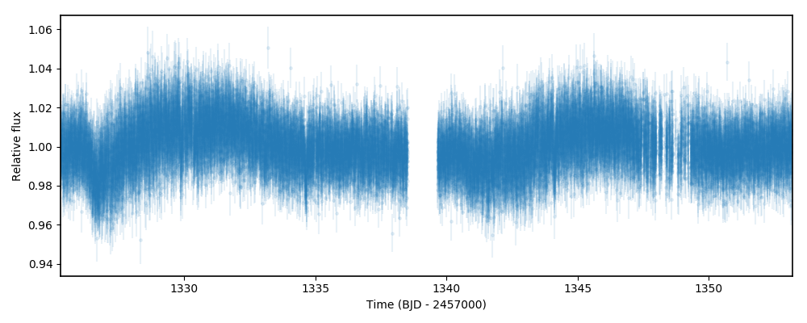
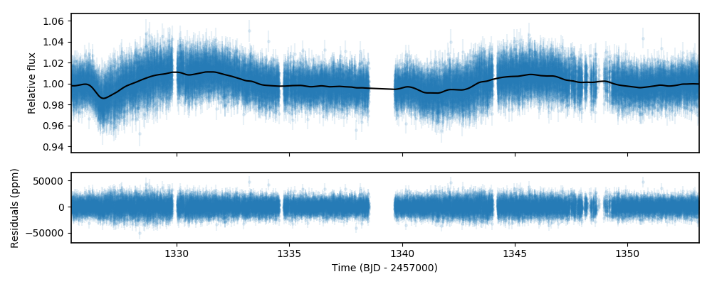
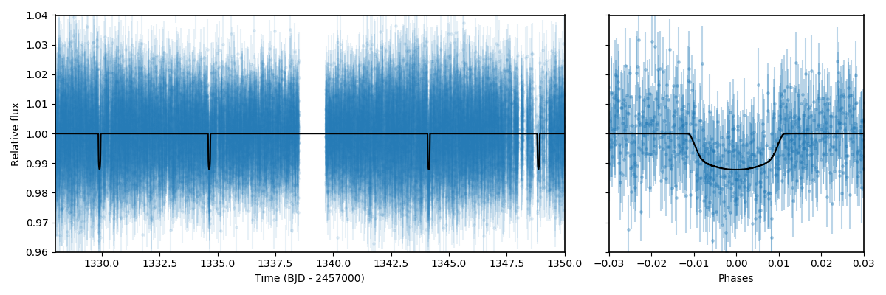
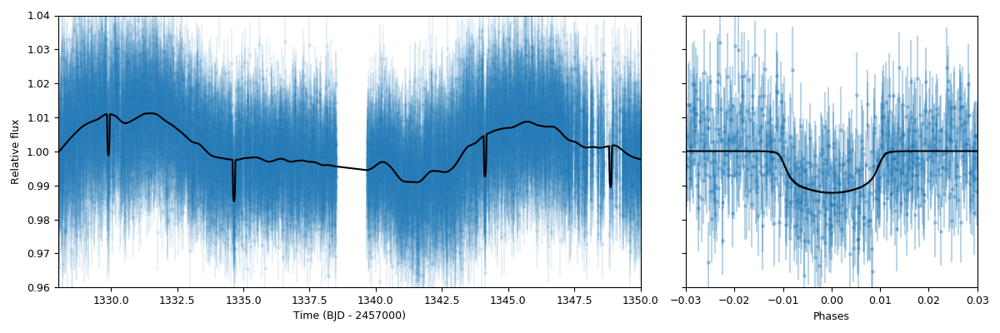
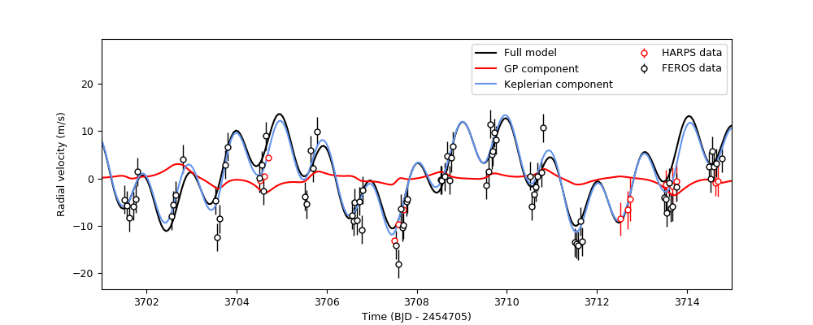
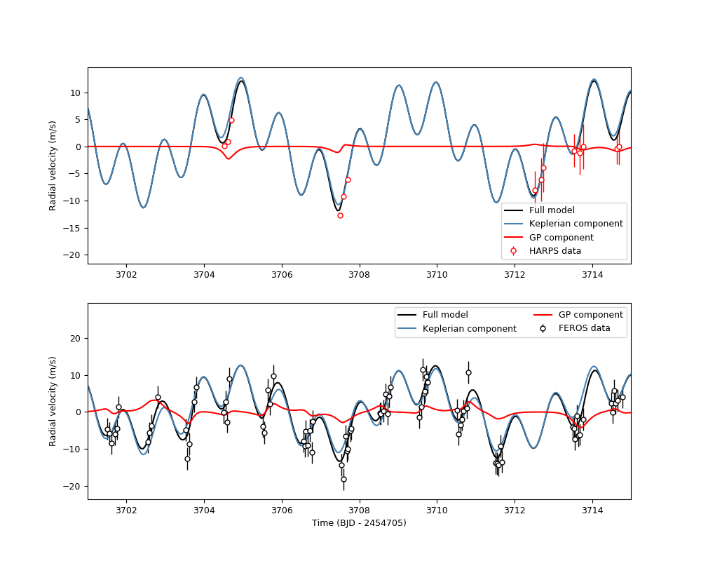
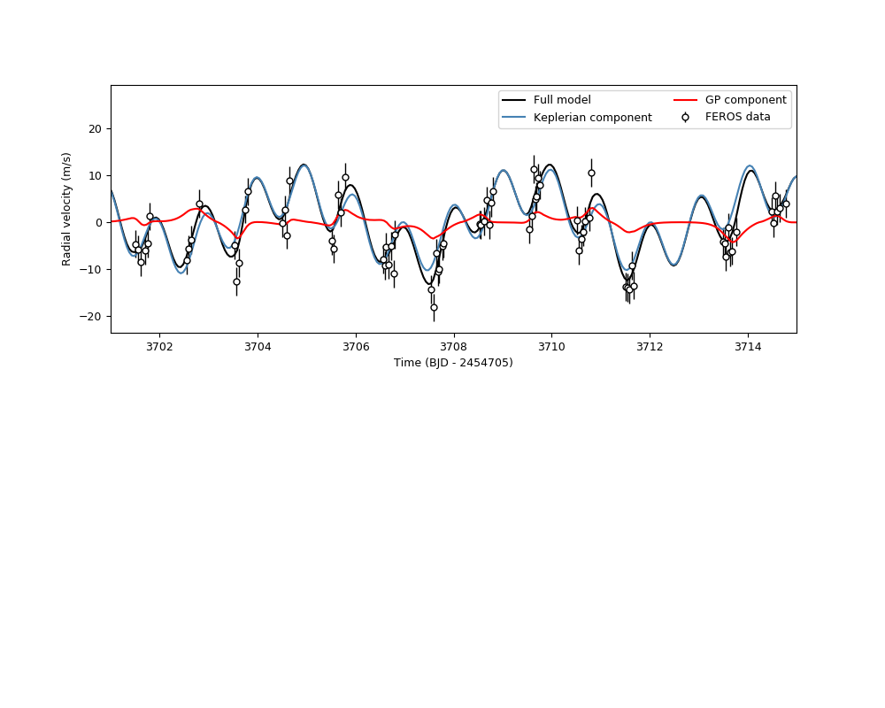

.. _gps:

Incorporating Gaussian Processes
===================

So far in the tutorials we have dealt with gaussian white-noise as a good approximation to the underlying 
signals present behind our transits and radial-velocities. However, this kind of process is very unrealistic 
for real data. Within ``juliet``, we allow to model non-white noise models using Gaussian Proccesses (GPs), 
which are not only good for underlying stochastic processes that might be present in the data, but are also very 
good for modelling underlying deterministic processes for which we do not have a good model at hand. GPs attempt to model 
the likelihood, :math:`\mathcal{L}`, as coming from a multi-variate gaussian distribution, i.e., 

:math:`\ln \mathcal{L} =  -\frac{1}{2}\left[N\ln 2\pi + \ln\left|\mathbf{\Sigma}\right|  + \vec{r}^T \mathbf{\Sigma}^{-1}\vec{r} \right],`

where :math:`\ln \mathcal{L}` is the log-likelihood, :math:`N` is the number of datapoints, :math:`\mathbf{\Sigma}` is a covariance matrix and :math:`\vec{r}` is the vector 
of the residuals (where each elements is simply our model --- be it a lightcurve model or radial-velocity model --- minus 
the data). A GP provides a form for the covariance matrix using so-called kernels which define its structure, 
and allow to efficiently fit for this underlying non-white noise structure. Within ``juliet`` we provide a wide variety of kernels 
which are implemented through `george <https://george.readthedocs.io/en/latest/>`_ and 
`celerite <https://celerite.readthedocs.io/en/stable/>`_. In this tutorial we test their capabilities using real exoplanetary data!

Detrending lightcurves with GPs
-------------------------------
A very popular use of GPs is to use them for "detrending" lightcurves. This means using the data outside of the feature 
of interest (e.g., a transit) in order to predict the behaviour of the lightcurve inside the feature and remove it, in 
order to facilitate or simplify the lightcurve fitting. To highlight the capabilities of ``juliet``, here we will play around 
with *TESS* data obtained in Sector 1 for the HATS-46b system (`Brahm et al., 2017 <https://arxiv.org/abs/1707.07093>`_). We already 
analyzed transits in Sector 2 for this system in the :ref:`transitfit` tutorial, but here we will tackle Sector 1 data as the systematics 
in this sector are much stronger than the ones of Sector 2.

Let's start by downloading and plotting the *TESS* data for HATS-46b in Sector 1 using ``juliet``:

.. code-block:: python

   import juliet
   import numpy as np
   import matplotlib.pyplot as plt

   # First, get arrays of times, normalized-fluxes and errors for HATS-46 
   #from Sector 1 from MAST:
   t, f, ferr  = juliet.get_TESS_data('https://archive.stsci.edu/hlsps/'+\
                                      'tess-data-alerts/hlsp_tess-data-'+\
                                      'alerts_tess_phot_00281541555-s01_'+\
                                      'tess_v1_lc.fits')
   # Plot the data:
   plt.errorbar(t,f,yerr=ferr,fmt='.')
   plt.xlim([np.min(t),np.max(t)])
   plt.xlabel('Time (BJD - 2457000)')
   plt.ylabel('Relative flux') 

As can be seen, the data has a fairly strong long-term trend going around. In fact, the trend is so strong that it is quite hard 
to see the transits by eye! Let us try to get rid of this trend by fitting a GP to the out-of-transit data, and then *predict* 
the in-transit flux with this model to remove these systematics in the data. Let us first isolate the out-of-transit data from 
the in-transit data using the ephemerides 
published in `Brahm et al., 2017 <https://arxiv.org/abs/1707.07093>`_ --- we know where the transits should be, so we will 
simply phase-fold the data and remove all datapoints out-of-transit (which judging from the plots in that paper, should be all 
points at absolute phases above 0.02). Let us save this out-of-transit data in dictionaries so we can feed them to ``juliet``:

.. code-block:: python

   # Period and t0 from Anderson et al. (201X):
   P,t0 =  4.7423729 ,  2457376.68539 - 2457000
   # Get phases --- identify out-of-transit (oot) times by phasing the data 
   # and selecting all points at absolute phases larger than 0.02:
   phases = juliet.utils.get_phases(t, P, t0)
   idx_oot = np.where(np.abs(phases)>0.02)[0]   
   # Save the out-of-transit data into dictionaries so we can feed them to juliet:
   times, fluxes, fluxes_error = {},{},{}
   times['TESS'], fluxes['TESS'], fluxes_error['TESS'] = t[idx_oot],f[idx_oot],ferr[idx_oot]

Now, let us fit a GP to this data. To do this, we will use a simple (approximate) Matern kernel, which was implemented via 
`celerite <https://celerite.readthedocs.io/en/stable/>`_ and which can accomodate itself to both rough and smooth signals. On top of this, 
the selection was also made because this is implemented in ``celerite``, which makes the computation of the 
log-likelihood blazing fast --- this in turn speeds up the posterior sampling within ``juliet``. The kernel is given by

:math:`k(\tau_{i,j}) = \sigma^2_{GP}\tilde{M}(\tau_{i,j},\rho) + (\sigma^2_{i} + \sigma^2_{w})\delta_{i,j}`,

where :math:`k(\tau_{i,j})` gives the element :math:`i,j` of the covariance matrix :math:`\mathbf{\Sigma}`, :math:`\tau_{i,j} = |t_i - t_j|` 
with the :math:`t_i` and :math:`t_j` being the :math:`i` and :math:`j` GP regressors (typically --- as in this case --- the times), 
:math:`\sigma_i` the errorbar of the :math:`i`-th datapoint, :math:`\sigma_{GP}` sets the amplitude (in ppm) of the GP, :math:`\sigma_w` (in ppm) is an added 
(unknown) *jitter* term, :math:`\delta_{i,j}` a Kronecker's delta (i.e., zero when :math:`i \neq j`, one otherwise) and where

:math:`\tilde{M}(\tau_{i,j},\rho) = [(1+1/\epsilon)\exp(-[1-\epsilon]\sqrt{3}\tau/\rho) + (1- 1/\epsilon)\exp(-[1+\epsilon]\sqrt{3}\tau/\rho)]`

is the (approximate) Matern part of the kernel, which has a characteristic length-scale :math:`\rho`.

To use this kernel within ``juliet`` you just have to give the priors for these parameters in the prior dictionary or file (see below for 
a full list of all the available kernels). ``juliet`` will automatically recognize which kernel you want based on the priors selected for 
each instrument. In this case, if you define a parameter ``GP_sigma`` (for :math:`\sigma_{GP}`) and ``rho`` (for the 
Matern time-scale, :math:`\rho`), ``juliet`` will automatically recognize you want to use this (approximate) Matern kernel. Let's thus give 
these priors --- for now, let us set the dilution factor ``mdilution`` to 1, give a normal prior for the mean out-of-transit flux ``mflux`` and 
wide log-uniform priors for all the other parameters:

.. code-block:: python
    :emphasize-lines: 16

    # Set the priors:
    params =  ['mdilution_TESS', 'mflux_TESS', 'sigma_w_TESS', 'GP_sigma_TESS', \
               'GP_rho_TESS']
    dists =   ['fixed',          'normal',     'loguniform',   'loguniform',\
               'loguniform']
    hyperps = [1., [0.,0.1], [1e-6, 1e6], [1e-6, 1e6],\
               [1e-3,1e3]]

    priors = {}
    for param, dist, hyperp in zip(params, dists, hyperps):
        priors[param] = {}
        priors[param]['distribution'], priors[param]['hyperparameters'] = dist, hyperp

    # Perform the juliet fit. Load dataset first (note the GP regressor will be the times):
    dataset = juliet.load(priors=priors, t_lc = times, y_lc = fluxes, \
                          yerr_lc = fluxes_error, GP_regressors_lc = times, \
                          out_folder = 'hats46_detrending')
    # Fit:
    results = dataset.fit()

Note that the only new part in terms of loading the dataset is that one has to now add a new piece of data, the ``GP_regressors_lc``, 
in order for the GP to run (emphasized in the code above). This is also a dictionary, which specifies the GP regressors for each instrument. 
For ``celerite`` kernels, in theory the regressors have to be one-dimensional and ordered in ascending or descending order --- however, 
internally ``juliet`` performs this ordering so the user doesn't have to worry about this last part. Let us now plot the GP fit and some 
residuals below to see how we did:

.. code-block:: python

    # Import gridspec:
    import matplotlib.gridspec as gridspec
    # Get juliet model prediction for the full lightcurve:
    model_fit = results.lc.evaluate('TESS')

    # Plot:
    fig = plt.figure(figsize=(10,4))
    gs = gridspec.GridSpec(2, 1, height_ratios=[2,1])

    # First the data and the model on top:
    ax1 = plt.subplot(gs[0])
    ax1.errorbar(times['TESS'], fluxes['TESS'], fluxes_error['TESS'],fmt='.',alpha=0.1)
    ax1.plot(times['TESS'], model_fit, color='black', zorder=100)
    ax1.set_ylabel('Relative flux')
    ax1.set_xlim(np.min(times['TESS']),np.max(times['TESS']))
    ax1.xaxis.set_major_formatter(plt.NullFormatter())

    # Now the residuals:
    ax2 = plt.subplot(gs[1])
    ax2.errorbar(times['TESS'], (fluxes['TESS']-model_fit)*1e6, \
                 fluxes_error['TESS']*1e6,fmt='.',alpha=0.1)
    ax2.set_ylabel('Residuals (ppm)')
    ax2.set_xlabel('Time (BJD - 2457000)')
    ax2.set_xlim(np.min(times['TESS']),np.max(times['TESS']))    

Seems we did pretty good! By default, the ``results.lc.evaluate`` function evaluates the model on the input dataset (i.e., on the 
input GP regressors and input times). In our case, this was the out-of-transit data. To detrend the lightcurve, however, we have to *predict* 
the model on the full time-series. This is easily done using the same function but giving the times and GP regressors we want to predict the 
data on. So let us detrend the original lightcurve (stored in the arrays ``t``, ``f`` and ``ferr`` that we extracted at the beggining of 
this section), and fit a transit to it to see how we do:

.. code-block:: python

    # Get model prediction from juliet:
    model_prediction = results.lc.evaluate('TESS', t = t, GPregressors = t)

    # Repopulate dictionaries with new detrended flux:
    times['TESS'], fluxes['TESS'], fluxes_error['TESS'] = t, f/model_prediction, \
                                                          ferr/model_prediction

    # Set transit fit priors:
    priors = {}

    params = ['P_p1','t0_p1','r1_p1','r2_p1','q1_TESS','q2_TESS','ecc_p1','omega_p1',\
                  'rho', 'mdilution_TESS', 'mflux_TESS', 'sigma_w_TESS']

    dists = ['normal','normal','uniform','uniform','uniform','uniform','fixed','fixed',\
                     'loguniform', 'fixed', 'normal', 'loguniform']

    hyperps = [[4.7,0.1], [1329.9,0.1], [0.,1], [0.,1.], [0., 1.], [0., 1.], 0.0, 90.,\
                       [100., 10000.], 1.0, [0.,0.1], [0.1, 1000.]]

    # Populate the priors dictionary:
    for param, dist, hyperp in zip(params, dists, hyperps):
        priors[param] = {}
        priors[param]['distribution'], priors[param]['hyperparameters'] = dist, hyperp

    # Perform juliet fit:
    dataset = juliet.load(priors=priors, t_lc = times, y_lc = fluxes, \
                      yerr_lc = fluxes_error, out_folder = 'hats46_detrended_transitfit')

    results = dataset.fit()

    # Extract transit model prediction given the data:
    transit_model = results.lc.evaluate('TESS')

    # Plot results:
    fig = plt.figure(figsize=(10,4))
    gs = gridspec.GridSpec(1, 2, width_ratios=[2,1])
    ax1 = plt.subplot(gs[0])

    # Plot time v/s flux plot:
    ax1.errorbar(dataset.times_lc['TESS'], dataset.data_lc['TESS'], \
             yerr = dataset.errors_lc['TESS'], fmt = '.', alpha = 0.1)

    ax1.plot(dataset.times_lc['TESS'], transit_model,color='black',zorder=10)
 
    ax1.set_xlim([1328,1350])
    ax1.set_ylim([0.96,1.04])
    ax1.set_xlabel('Time (BJD - 2457000)')
    ax1.set_ylabel('Relative flux')
   
    # Now phased transit lightcurve:
    ax2 = plt.subplot(gs[1])
    ax2.errorbar(phases, dataset.data_lc['TESS'], \
                 yerr = dataset.errors_lc['TESS'], fmt = '.', alpha = 0.1)
    idx = np.argsort(phases)
    ax2.plot(phases[idx],transit_model[idx], color='black',zorder=10)
    ax2.yaxis.set_major_formatter(plt.NullFormatter())
    ax2.set_xlim([-0.03,0.03])
    ax2.set_ylim([0.96,1.04])
    ax2.set_xlabel('Phases')

Pretty good! In the next section, we explore *joint* fitting for the transit model and the GP process.

Joint GP and lightcurve fits
-----------------------------

One might wonder what the impact of doing the two-stage process mentioned above is when compared with fitting *jointly* 
the GP process and the transit model. This latter method, in general, seems more appealing because it can take into 
account in-transit non-white noise features, which in turn might give rise to more realistic errorbars on the retrieved 
planetary parameters. Within ``juliet`` performing this kind of model fit is fairly easy to do: one just has to add the 
priors for the GP process to the transit paramenters, and feed the GP regressors. Let us use the same GP kernel as in the 
previous section then to model the underlying process for HATS-46b *jointly* with the transit parameters:

.. code-block:: python
    :emphasize-lines: 7,11,15

    # First define the priors:
    priors = {}

    # Same priors as for the transit-only fit, but we now add the GP priors:
    params = ['P_p1','t0_p1','r1_p1','r2_p1','q1_TESS','q2_TESS','ecc_p1','omega_p1',\
              'rho', 'mdilution_TESS', 'mflux_TESS', 'sigma_w_TESS', \
              'GP_sigma_TESS', 'GP_rho_TESS']

    dists = ['normal','normal','uniform','uniform','uniform','uniform','fixed','fixed',\
             'loguniform', 'fixed', 'normal', 'loguniform', \
             'loguniform', 'loguniform']

    hyperps = [[4.7,0.1], [1329.9,0.1], [0.,1], [0.,1.], [0., 1.], [0., 1.], 0.0, 90.,\
               [100., 10000.], 1.0, [0.,0.1], [0.1, 1000.], \
               [1e-6, 1e6], [1e-3, 1e3]]

    # Populate the priors dictionary:
    for param, dist, hyperp in zip(params, dists, hyperps):
        priors[param] = {}
        priors[param]['distribution'], priors[param]['hyperparameters'] = dist, hyperp

    times['TESS'], fluxes['TESS'], fluxes_error['TESS'] = t,f,ferr
    dataset = juliet.load(priors=priors, t_lc = times, y_lc = fluxes, \
                          yerr_lc = fluxes_error, GP_regressors_lc = times, out_folder = 'hats46_transitGP', verbose = True)

    results = dataset.fit()

Note that in comparison with the transit-only fit, we have just added the priors for the GP parameters 
(highlighted lines above). The model being fit in this case by ``juliet`` is the one given in Section 2 
of the `juliet paper <https://arxiv.org/abs/1812.08549>`_, i.e., a model of the form

:math:`\mathcal{M}_{\textrm{TESS}}(t) + \epsilon(t)`,

where 

:math:`\mathcal{M}_{\textrm{TESS}}(t) = [\mathcal{T}_{\textrm{TESS}}(t)D_{\textrm{TESS}} + (1-D_{\textrm{TESS}})]\left(\frac{1}{1+D_{\textrm{TESS}}M_{\textrm{TESS}}}\right)`

is the photometric model composed of the dilution factor :math:`D_{\textrm{TESS}}` (``mdilution_TESS``), the mean out-of-transit 
flux :math:`M_{\textrm{TESS}}` (``mflux_TESS``) and the transit model for the instrument :math:`\mathcal{T}_{\textrm{TESS}}(t)` 
(defined by the transit parameters and by the instrument-dependant limb-darkening parametrization given by ``q1_TESS`` and ``q2_TESS``). 
This is the *deterministic* part of the model, as 
:math:`\mathcal{M}_{\textrm{TESS}}(t)` is a process that, given a time and a set of parameters, will always be the same: you can easily 
evaluate the model from the above definition. :math:`\epsilon(t)`, on the other hand, is the *stochastic* part of our model: a noise model which 
in our case is being modelled as a GP. Given a set of parameters and times for the GP model, the process *cannot* directly be evaluated because 
it defines a probability distribution, not a deterministic function like :math:`\mathcal{M}_{\textrm{TESS}}(t)`. This means that every time 
you sample from this GP, you would get a different curve --- ours was just *one realization* of many possible ones. However, we do have a 
(noisy) realization (our data) and so our process can be constrained by it. This is what we plotted in the previous section of this tutorial 
(which in strict rigor is a filter). Also note that in this model the GP is an additive process.

Once the fit is done, ``juliet`` allows to retrieve (1) the full median posterior model (i.e., the deterministic part of the model **plus** the 
median GP process) via the ``results.lc.evaluate()`` function already used in the previous section and (2) all parts of the model 
separately via the ``results.lc.model`` dictionary, which holds the ``deterministic`` key which hosts the deterministic part of the model 
(:math:`\mathcal{M}_{\textrm{TESS}}(t)`) and the ``GP`` key which holds the stochastic part of the model (:math:`\epsilon(t)`, constrained 
on the data). To show how this works, let us extract these components below in order to plot the full model, and remove the median GP process 
from the data in order to plot the ("systematics-corrected") phase-folded lightcurve:

.. code-block:: python

    # Extract full model:
    transit_plus_GP_model = results.lc.evaluate('TESS')

    # Deterministic part of the model (in our case transit divided by mflux):
    transit_model = results.lc.model['TESS']['deterministic']

    # GP part of the model:
    gp_model = results.lc.model['TESS']['GP']

    # Now plot. First preambles:
    fig = plt.figure(figsize=(12,4))
    gs = gridspec.GridSpec(1, 2, width_ratios=[2,1])
    ax1 = plt.subplot(gs[0])

    # Plot data
    ax1.errorbar(dataset.times_lc['TESS'], dataset.data_lc['TESS'], \
                 yerr = dataset.errors_lc['TESS'], fmt = '.', alpha = 0.1)

    # Plot the (full, transit + GP) model:
    ax1.plot(dataset.times_lc['TESS'], transit_plus_GP_model, color='black',zorder=10)

    ax1.set_xlim([1328,1350])
    ax1.set_ylim([0.96,1.04])
    ax1.set_xlabel('Time (BJD - 2457000)')
    ax1.set_ylabel('Relative flux')

    ax2 = plt.subplot(gs[1])

    # Now plot phase-folded lightcurve but with the GP part removed:
    ax2.errorbar(phases, dataset.data_lc['TESS'] - gp_model, \
                 yerr = dataset.errors_lc['TESS'], fmt = '.', alpha = 0.3)

    # Plot transit-only (divided by mflux) model:
    idx = np.argsort(phases)
    ax2.plot(phases[idx],transit_model[idx], color='black',zorder=10)
    ax2.yaxis.set_major_formatter(plt.NullFormatter())
    ax2.set_xlabel('Phases')
    ax2.set_xlim([-0.03,0.03])
    ax2.set_ylim([0.96,1.04])

Looks pretty good! As can be seen, the ``results.lc.model['TESS']['deterministic']`` dictionary holds the deterministic 
part of the model. This includes the transit model which is distorted by the dilution factor (set to 1 in our case) and the 
mean out-of-transit flux, which we fit together with the other parameters in our joint fit --- this deterministic model is the one 
that is plotted in the right panel in the above presented figure. The ``results.lc.model['TESS']['GP']`` dictionary, on the other 
hand, holds the GP part of the model --- because this is an additive process in this case, we can just substract it from the data 
in order to get the "systematic-corrected" data that we plot in the right panel in the figure above.

Global and instrument-by instrument GP models
---------------------------------------------

In the previous lightcurve analysis we dealt with GP models which are individually defined for each instrument. This means that even if 
the hyperparameters between the GPs (e.g., timescales) are shared between different instruments because we believe they might arise from the 
same parent physical process, we are modelling each instrument as if the data we observe in them was produced by a different realization from 
that GP. In some cases, however, we would want to model a GP which is *common* to all the instruments, i.e., a GP model whose realization gave 
rise to the data we see in *all* of our instruments simultaneously. Within ``juliet``, we refer to those kind of models as *global* GP models. 
These are most useful in radial-velocity analyses, where an underlying physical signal might be common to all the instruments. For example, we 
might believe a given signal in our radial-velocity data is produced by stellar activity, and if all the instruments have similar bandpasses, 
then the amplitude, period and timescales are associated with the process itself and not with each instrument. Of course, one can still define 
different individual jitter terms for each instrument in this case.

In practice, as explained in detail in the Section 2 of the `juliet paper <https://arxiv.org/abs/1812.08549>`_, the difference between a **global** model 
and an **instrument-by-instrument** model is that for the former a unique covariance matrix (and set of GP hyperparameters) is defined for the problem. 
This means that the log-likelihood of a **global** model is written as presented at the introduction of this tutorial, i.e.,

  :math:`\mathcal{L} =  -\frac{1}{2}\left[N\ln 2\pi + \ln\left|\mathbf{\Sigma}\right|  + \vec{r}^T \mathbf{\Sigma}^{-1}\vec{r} \right].`

Here, :math:`N` is the total number of datapoints considering all the instruments in the problem, :math:`\mathbf{\Sigma}` is the covariance matrix for 
that same full dataset and :math:`\vec{r}` is the vector of residuals for the same dataset. In the **instrument-by-instrument** type of models, however, a 
different covariance matrix (and thus different GP hyperparameters --- which might be shared, as we'll see in a moment!) is defined for each instrument. 
The total log-likelihood of the problem is, thus, given by:

  :math:`\mathcal{L} =  \sum_{i} -\frac{1}{2}\left[N_i\ln 2\pi + \ln\left|\mathbf{\Sigma}_i\right|  + \vec{r}_i^T \mathbf{\Sigma}_i^{-1}\vec{r}_i \right],`

where :math:`N_i` is the number of datapoints for instrument :math:`i`, :math:`\mathbf{\Sigma}_i` is the covariance matrix for that instrument and 
:math:`\vec{r}_i` is the vector of residuals for that same instrument. The lightcurve examples above were instrument-by-instrument models, which makes sense 
because the instrumental systematics were individual to the TESS lightcurves --- if we had to incorporate extra datasets, those would most likely have to have 
different GP hyperparameters (and, perhaps, kernels). Here, we will exemplify the difference between those two types of models using the radial-velocity dataset 
for TOI-141 already analyzed in the :ref:`rvfits` tutorial which can be downloaded from [`here <https://github.com/nespinoza/juliet/blob/master/docs/tutorials/rvs_toi141.dat>`_]. 
We will use the time as the GP regressor in our case; we have uplaoded a file containing those times 
[`here <https://github.com/nespinoza/juliet/blob/master/docs/tutorials/GP_regressors_rv.dat>`_].

Let us start by fitting a *global* GP model to that data. To this end, let's try to fit the same Matern kernel defined in the previous GP 
examples. To define a global GP model, for radial-velocity fits, one has to simply add ``rv`` instead of the instrument name to the GP hyperparameters:

.. code-block:: python

    import numpy as np
    import juliet
    priors = {}

    # Name of the parameters to be fit:
    params = ['P_p1','t0_p1','mu_CORALIE14', \
              'mu_CORALIE07','mu_HARPS','mu_FEROS',\
              'K_p1', 'ecc_p1', 'omega_p1', 'sigma_w_CORALIE14','sigma_w_CORALIE07',\
               'sigma_w_HARPS','sigma_w_FEROS','GP_sigma_rv','GP_rho_rv']

    # Distributions:
    dists = ['normal','normal','uniform', \
             'uniform','uniform','uniform',\
             'uniform','fixed', 'fixed', 'loguniform', 'loguniform',\
             'loguniform', 'loguniform','loguniform','loguniform']

    # Hyperparameters
    hyperps = [[1.007917,0.000073], [2458325.5386,0.0011], [-100,100], \
               [-100,100], [-100,100], [-100,100], \
               [0.,100.], 0., 90., [1e-3, 100.], [1e-3, 100.], \
               [1e-3, 100.], [1e-3, 100.],[0.01,100.],[0.01,100.]]

    # Populate the priors dictionary:
    for param, dist, hyperp in zip(params, dists, hyperps):
        priors[param] = {}
        priors[param]['distribution'], priors[param]['hyperparameters'] = dist, hyperp

    # Add second planet to the prior:
    params = params + ['P_p2',   't0_p2',  'K_p2',    'ecc_p2','omega_p2']
    dists = dists +   ['uniform','uniform','uniform', 'fixed', 'fixed']
    hyperps = hyperps + [[1.,10.],[2458325.,2458330.],[0.,100.], 0., 90.]

    # Repopulate priors dictionary:
    priors = {}

    for param, dist, hyperp in zip(params, dists, hyperps):
        priors[param] = {}
        priors[param]['distribution'], priors[param]['hyperparameters'] = dist, hyperp

    dataset = juliet.load(priors = priors, rvfilename='rvs_toi141.dat', out_folder = 'toi141_rvs-global', \
                          GPrveparamfile='GP_regressors_rv.dat')

    results = dataset.fit(n_live_points = 300)

Once done, let's plot the results. We'll plot a portion of the time-series so we can check what the different components of the model are doing, 
and only plot the HARPS and FEROS data, which are the most constraining for our dataset:

.. code-block:: python

    # Define minimum and maximum times to evaluate the model on:
    min_time, max_time = np.min(dataset.times_rv['FEROS'])-30,\
                     np.max(dataset.times_rv['FEROS'])+30

    # Create model times on which we will evaluate the model:
    model_times = np.linspace(min_time,max_time,5000)

    # Extract full model and components of the RV model:
    full_model, components = results.rv.evaluate('FEROS', t = model_times, GPregressors = model_times, return_components = True)

    import matplotlib.pyplot as plt
    instruments = ['HARPS','FEROS']
    colors = ['red','black']

    fig = plt.figure(figsize=(10,4))
    for instrument,color in zip (instruments,colors):
        plt.errorbar(dataset.times_rv[instrument]-2454705,dataset.data_rv[instrument] - components['mu'][instrument], \
                     yerr = dataset.errors_rv[instrument], fmt = 'o', label = instrument+' data',mfc='white', mec = color, ecolor = color, \
                     elinewidth=1)

    plt.plot(model_times-2454705,full_model - components['mu']['FEROS'],label='Full model',color='black')
    plt.plot(model_times-2454705,results.rv.model['deterministic'],label = 'Keplerian component', color = 'steelblue')
    plt.plot(model_times-2454705,results.rv.model['GP'], label = 'GP component',color='red')
    plt.xlim([3701,3715])
    plt.ylabel('Radial velocity (m/s)')
    plt.xlabel('Time (BJD - 2454705)')
    plt.legend(ncol=2)

Nice! This plot is very similar to the one shown in Figure 8 of the TOI-141b paper in `Espinoza et al. (2019) <https://arxiv.org/abs/1903.07694>`_ --- only that in that 
paper, the authors used a different kernel. It is reassurring that this simple kernel gives very similar results! As can be seen, the key idea of a *global* model is evident 
from these results: it is a model that spans different instruments, modelling what could be an underlying physical process that impacts all of them simultaneously.

Now let us model the same data assuming an **instrument-by-instrument** model. For this, let's suppose the time-scale of the process is common to all the instruments, but that the 
amplitudes of the process are different for each of them. In order to tell to ``juliet`` that we want an instrument-by-instrument model, we have to first create a file with the GP regressors 
that identifies the regressors for each instrument --- we have uploaded the one used in this example 
[`here <https://github.com/nespinoza/juliet/blob/master/docs/tutorials/GP_regressors_rv_i-i.dat>`_]. Then, we simply define the GP hyperparameters for each instrument --- common parameters 
between instruments will have instruments separated by underscores after the GP hyperparameter name, like for ``GP_rho`` below:

.. code-block:: python

    priors = {}

    # Name of the parameters to be fit:
    params = ['P_p1','t0_p1','mu_CORALIE14', \
              'mu_CORALIE07','mu_HARPS','mu_FEROS',\
              'K_p1', 'ecc_p1', 'omega_p1', 'sigma_w_CORALIE14','sigma_w_CORALIE07',\
              'sigma_w_HARPS','sigma_w_FEROS','GP_sigma_HARPS','GP_sigma_FEROS','GP_sigma_CORALIE14', 'GP_sigma_CORALIE07',\
              'GP_rho_HARPS_FEROS_CORALIE14_CORALIE07']

    # Distributions:
    dists = ['normal','normal','uniform', \
             'uniform','uniform','uniform',\
             'uniform','fixed', 'fixed', 'loguniform', 'loguniform',\
             'loguniform', 'loguniform','loguniform','loguniform','loguniform','loguniform',\
             'loguniform']

    # Hyperparameters
    hyperps = [[1.007917,0.000073], [2458325.5386,0.0011], [-100,100], \
               [-100,100], [-100,100], [-100,100], \
               [0.,100.], 0., 90., [1e-3, 100.], [1e-3, 100.], \
               [1e-3, 100.], [1e-3, 100.],[0.01,100.],[0.01,100.],[0.01,100.],[0.01,100.],\
               [0.01,100.]]

    # Populate the priors dictionary:
    for param, dist, hyperp in zip(params, dists, hyperps):
        priors[param] = {}
        priors[param]['distribution'], priors[param]['hyperparameters'] = dist, hyperp

    # Add second planet to the prior:
    params = params + ['P_p2',   't0_p2',  'K_p2',    'ecc_p2','omega_p2']
    dists = dists +   ['uniform','uniform','uniform', 'fixed', 'fixed']
    hyperps = hyperps + [[1.,10.],[2458325.,2458330.],[0.,100.], 0., 90.]

    # Repopulate priors dictionary:
    priors = {}

    for param, dist, hyperp in zip(params, dists, hyperps):
        priors[param] = {}
        priors[param]['distribution'], priors[param]['hyperparameters'] = dist, hyperp

    dataset = juliet.load(priors = priors, rvfilename='rvs_toi141.dat', out_folder = 'toi141_rvs_i-i', \
                          GPrveparamfile='GP_regressors_rv_i-i.dat', verbose = True)

    results = dataset.fit(n_live_points = 300)

Now let us plot the results of the fit. Because this is an instrument-by-instrument model, we have to plot the fits individually for each instruments. Let's plot the FEROS and HARPS data 
once again:

.. code-block:: python

    model_times = np.linspace(np.max(dataset.t_rv)-50,np.max(dataset.t_rv),1000)

    import matplotlib.pyplot as plt
    instruments = ['HARPS','FEROS']
    colors = ['red','black']

    fig = plt.figure(figsize=(10,8))
    counter = 0
    for instrument,color in zip (instruments,colors):
        plt.subplot('21'+str(counter+1))
        keplerian, components = results.rv.evaluate(instrument,t = model_times, GPregressors = model_times, return_components = True)
        plt.errorbar(dataset.times_rv[instrument]-2454705,dataset.data_rv[instrument] - components['mu'], \
                     yerr = dataset.errors_rv[instrument], fmt = 'o', label = instrument+' data',mfc='white', mec = color, ecolor = color, \
                     elinewidth=1)
        plt.plot(model_times-2454705,keplerian,label='Full model',color='black')
        plt.plot(model_times-2454705,results.rv.model[instrument]['deterministic'],label = 'Keplerian component', color = 'steelblue')
        plt.plot(model_times-2454705,results.rv.model[instrument]['GP'], label = 'GP component',color='red')
        counter += 1
        plt.legend()
        plt.xlim([3701,3715])
        plt.ylabel('Radial velocity (m/s)')
    plt.xlabel('Time (BJD - 2454705)')

Notice how in this instrument-by-instrument GP fit, not only the amplitude but the overall shape of the GP component is different between instruments. This is exactly what 
we are modelling with an instrument-by-instrument GP fit: a process that might share some hyperparameters, but that has different realizations on each instrument. 

So, is the instrument-by-instrument model or the global GP fit the best for the TOI-141 dataset? We can use the log-evidences to find this out! For the global model, we 
obtain a log-evidence of :math:`\ln Z = -678.76 \pm 0.03`, whereas for the instrument-by-instrument model we obtain a log-evidence of :math:`\ln Z = -679.4 \pm 0.1`. From this, 
we see that although they are statistically indistinguishable (:math:`\Delta \ln Z < 2`), we will most likely want to favor the global model as it has fewer parameters. One interesting 
point the reader might make is that, from the plots above, it might *seem* FEROS is dominating the GP component --- so it might be that the GP signal is actually arising from the 
FEROS data, and not from all the other instruments. One way to check if this is the case is to run an instrument-by-instrument GP model where a GP is applied only to the FEROS data; 
physically, this would be modelling a signal that is only arising in this instrument due to, e.g., unknown instrumental systematics. It is easy to test this out with ``juliet``; 
we just repeat the instrument-by-instrument model above but adding a GP only to the FEROS data:

.. code-block:: python

    priors = {}

    # Name of the parameters to be fit:
    params = ['P_p1','t0_p1','mu_CORALIE14', \
              'mu_CORALIE07','mu_HARPS','mu_FEROS',\
              'K_p1', 'ecc_p1', 'omega_p1', 'sigma_w_CORALIE14','sigma_w_CORALIE07',\
              'sigma_w_HARPS','sigma_w_FEROS','GP_sigma_FEROS', 'GP_rho_FEROS']

    # Distributions:
    dists = ['normal','normal','uniform', \
             'uniform','uniform','uniform',\
             'uniform','fixed', 'fixed', 'loguniform', 'loguniform',\
             'loguniform', 'loguniform','loguniform','loguniform']

    # Hyperparameters
    hyperps = [[1.007917,0.000073], [2458325.5386,0.0011], [-100,100], \
               [-100,100], [-100,100], [-100,100], \
               [0.,100.], 0., 90., [1e-3, 100.], [1e-3, 100.], \
               [1e-3, 100.], [1e-3, 100.],[0.01,100.],[0.01,100.]]

    # Populate the priors dictionary:
    for param, dist, hyperp in zip(params, dists, hyperps):
        priors[param] = {}
        priors[param]['distribution'], priors[param]['hyperparameters'] = dist, hyperp

    # Add second planet to the prior:
    params = params + ['P_p2',   't0_p2',  'K_p2',    'ecc_p2','omega_p2']
    dists = dists +   ['uniform','uniform','uniform', 'fixed', 'fixed']
    hyperps = hyperps + [[1.,10.],[2458325.,2458330.],[0.,100.], 0., 90.]

    # Repopulate priors dictionary:
    priors = {}

    for param, dist, hyperp in zip(params, dists, hyperps):
        priors[param] = {}
        priors[param]['distribution'], priors[param]['hyperparameters'] = dist, hyperp

    dataset = juliet.load(priors = priors, rvfilename='rvs_toi141.dat', out_folder = 'toi141_rvs_i-i-FEROS', \
                          GPrveparamfile='GP_regressors_rv_i-i-FEROS.dat', verbose = True)

    results = dataset.fit(n_live_points = 300)

Let us plot the result to see how this looks like:

.. code-block:: python

    model_times = np.linspace(np.max(dataset.t_rv)-50,np.max(dataset.t_rv),1000)

    import matplotlib.pyplot as plt
    instruments = ['FEROS']
    colors = ['black']

    fig = plt.figure(figsize=(10,8))
    counter = 0
    for instrument,color in zip (instruments,colors):
        plt.subplot('21'+str(counter+1))
        keplerian, components = results.rv.evaluate(instrument,t = model_times, GPregressors = model_times, return_components = True)
        plt.errorbar(dataset.times_rv[instrument]-2454705,dataset.data_rv[instrument] - components['mu'], \
                     yerr = dataset.errors_rv[instrument], fmt = 'o', label = instrument+' data',mfc='white', mec = color, ecolor = color, \
                     elinewidth=1)
        plt.plot(model_times-2454705,keplerian,label='Full model',color='black')
        plt.plot(model_times-2454705,results.rv.model[instrument]['deterministic'],label = 'Keplerian component', color = 'steelblue')
        plt.plot(model_times-2454705,results.rv.model[instrument]['GP'], label = 'GP component',color='red')
        counter += 1
        plt.legend()
        plt.xlim([3701,3715])
        plt.ylabel('Radial velocity (m/s)')
    plt.xlabel('Time (BJD - 2454705)')
    plt.legend(ncol=2)

It seems the signal is fairly similar in this narrow time-range to the one we obtained in the global model and the instrument-by-instrument models above! 
However, ``juliet`` has one more piece of data that can allow us to discriminate the "best" model: the log-evidence. This model has a log-evidence of 
:math:`\ln Z = -681.65 \pm 0.07` --- the global model has a log-evidence which is :math:`\Delta \ln Z = 2.9` *higher* than this model and thus is about 
18 times more likely than this FEROS-only instrument-by-instrument model. Given our data, then, it seems the *global* model is the best model at hand, at 
least compared against the instrument-by-instrument models defined above.
