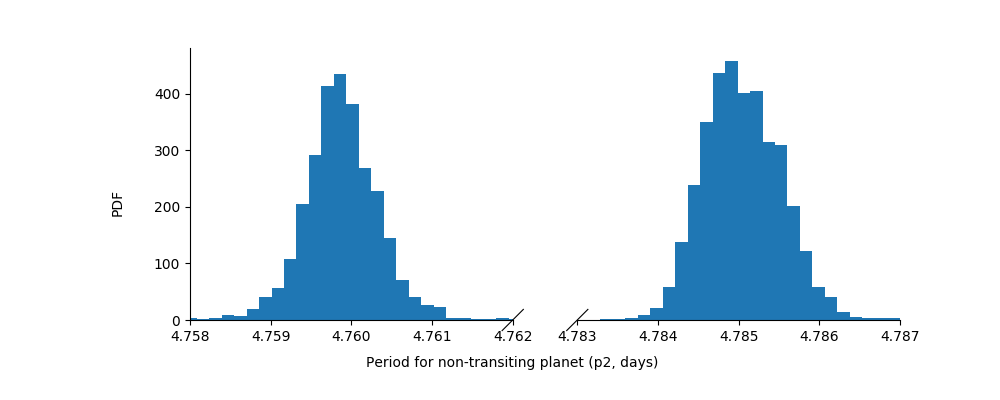
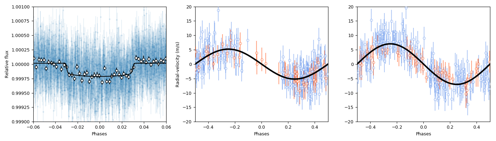

.. _jointfits:

Joint transit and radial-velocity fits
===================

We have dealt so far separately between fitting transit lightcurves in the :ref:`transitfit` tutorial and with fitting 
radial-velocity data in the :ref:`rvfits` tutorial. Here, we simply join what we have learned in those tutorials in order 
to showcase the ability of ``juliet`` to fit both dataset simultaneously. 

In the background, ``juliet`` simply assumes both of these datasets are independant but that they can have common 
parameters. For example, the period and time-of-transit center are common to both datasets, but the radial-velocity 
semi-amplitude is only constrained by the radial-velocity dataset. Performing joint fits, thus, one can jointly extract 
information for common parameters between those datasets simultaneously in order to properly propagate that into the 
uncertainties and correlations between all the parameters being constrained.

Here, we use the TOI-141 dataset whose transit information was already presented in the :ref:`quickstart` section, and 
whose radial-velocity data was already presented in the :ref:`rvfits` section.

A joint fit to the TOI-141 system
----------------------------------

In the :ref:`rvfits` tutorial, we have already seen how the RV data (which you can download from [`here <https://github.com/nespinoza/juliet/blob/master/docs/tutorials/rvs_toi141.dat>`_]) support the presence of at least two planets in the system, while in the :ref:`quickstart` section we have already seen 
how to fit a transit lightcurve for this system. Let us then simply join the prior distributions and data from these two sections into one. Let's 
first define the joint prior distribution:

.. code-block:: python

    # Define the master prior dictionary. First define the TRANSIT priors:
    priors = {}

    # Name of the parameters to be fit:
    params = ['P_p1','t0_p1','r1_p1','r2_p1','q1_TESS','q2_TESS','ecc_p1','omega_p1',\
                  'rho', 'mdilution_TESS', 'mflux_TESS', 'sigma_w_TESS']

    # Distribution for each of the parameters:
    dists = ['normal','normal','uniform','uniform','uniform','uniform','fixed','fixed',\
                     'loguniform', 'fixed', 'normal', 'loguniform']

    # Hyperparameters of the distributions (mean and standard-deviation for normal 
    # distributions, lower and upper limits for uniform and loguniform distributions, and 
    # fixed values for fixed "distributions", which assume the parameter is fixed). Note prior 
    # on t0 has an added 2457000 to convert from TESS JD to JD:
    hyperps = [[1.,0.1], [2457000 + 1325.55,0.1], [0.,1], [0.,1.], [0., 1.], [0., 1.], 0.0, 90.,\
                       [100., 10000.], 1.0, [0.,0.1], [0.1, 1000.]]

    # Populate the priors dictionary:
    for param, dist, hyperp in zip(params, dists, hyperps):
        priors[param] = {}
        priors[param]['distribution'], priors[param]['hyperparameters'] = dist, hyperp

    # Now define the RV priors:
    params = ['mu_CORALIE14', 'mu_CORALIE07','mu_HARPS','mu_FEROS', 'K_p1', 'sigma_w_CORALIE14','sigma_w_CORALIE07',\
               'sigma_w_HARPS','sigma_w_FEROS','P_p2',   't0_p2',  'K_p2', 'ecc_p2', 'omega_p2']

    # Distributions:
    dists = ['uniform', 'uniform','uniform','uniform', 'uniform', 'loguniform', 'loguniform',\
             'loguniform', 'loguniform', 'uniform','uniform','uniform', 'fixed', 'fixed']

    # Hyperparameters
    hyperps = [[-100,100], [-100,100], [-100,100], [-100,100], [0.,100.], [1e-3, 100.], [1e-3, 100.], \
               [1e-3, 100.], [1e-3, 100.], [1.,10.], [2458325.,2458330.], [0.,100.], 0., 90.]

    # Populate the priors dictionary:
    for param, dist, hyperp in zip(params, dists, hyperps):
        priors[param] = {}
        priors[param]['distribution'], priors[param]['hyperparameters'] = dist, hyperp

Now let's get the transit data, load the radial-velocity data and priors into ``juliet`` and run the fit:

.. code-block:: python

   import juliet
   import numpy as np

   # First get TESS photometric data:
   t,f,ferr  = juliet.get_TESS_data('https://archive.stsci.edu/hlsps/tess-data-alerts/'+\
                                 'hlsp_tess-data-alerts_tess_phot_00403224672-'+\
                                 's01_tess_v1_lc.fits')

   # Put data in dictionaries, add 2457000 to the times to convert from TESS JD to JD:
   times, fluxes, fluxes_error = {},{},{}
   times['TESS'], fluxes['TESS'], fluxes_error['TESS'] = t + 2457000,f,ferr
  
   # RV data is given in a file, so let's just pass the filename to juliet and load the dataset:
   dataset = juliet.load(priors=priors, t_lc = times, y_lc = fluxes, \
                      yerr_lc = fluxes_error, rvfilename='rvs_toi141.dat', \
                      out_folder = 'toi141_jointfit')

   # And now let's fit it!
   results = dataset.fit(n_live_points = 500)

We first should note that this fit has 21 (!) free parameters. Consequently, we have increased the number of live-points 
(with respect to other tutorials were we defined it to be 300) as there is a larger parameter space the live-points 
have to explore (for details on this, check Section 2.5 of the `juliet paper <https://arxiv.org/abs/1812.08549>`_ and 
references therein). As a rule-of-thumb, live-points :math:`n_\textrm{live}` should scale with about the square of the number 
of parameters :math:`n_p`. In our case, :math:`n_p = 21` so :math:`n_\textrm{live}\sim n_p^2 = 440` --- we set it to 500 just 
to be on the safe side. Given the enlarged parameter space and number of live-points, the run will of course take longer to 
finish --- in my laptop, this fit took about an hour. 

Let's plot the *phased* transit lightcurve and radial-velocities of the planets in the same plot, so we can showcase some nice 
tricks that can be handy for dealing with the results provided by ``juliet``. First, let us prepare the plot; we'll generate 
three panels. On the first we'll plot the phased transit lightcurve, and in the other two we'll plot the phased radial-velocities 
of the other planets:

.. code-block:: python

   import matplotlib.pyplot as plt
   import matplotlib.gridspec as gridspec
   fig = plt.figure(figsize=(14,4))
   gs = gridspec.GridSpec(1, 3, width_ratios=[2,2,2])

Let's first deal with **the plot for the transiting planet lightcurve** (``p1``). For this one, we will not only plot the phased data and model, but 
will also bin the data so we can more easily see the transit event --- to this end we will use the ``juliet.bin_data`` function, 
which given times/phases, data and a number of bins, will bin your data and return binned times/phases, data and errors:

.. code-block:: python

    # Plot phased transit data and model first. Let's extract the transit 
    # model --- lightcurve is well sampled, so use the same input times to plot the model:
    transit_model = results.lc.evaluate('TESS')

    # Extract period and time-of-transit center for the planet:
    P, t0 = np.median(results.posteriors['posterior_samples']['P_p1']),\
            np.median(results.posteriors['posterior_samples']['t0_p1'])

    # Define plot, get phases, plot data and best-fit model:
    ax1 = plt.subplot(gs[0])          
    
    phases = juliet.get_phases(dataset.times_lc['TESS'], P, t0)
    idx = np.argsort(phases)
    ax1.errorbar(phases, dataset.data_lc['TESS'], yerr= dataset.errors_lc['TESS'], fmt = '.', alpha=0.1)
    ax1.plot(phases[idx],transit_model[idx], color='black',zorder=10)

    # Plot binned data as well, binning 40 datapoints in phase-space:
    p_bin, y_bin, yerr_bin = juliet.bin_data(phases[idx], dataset.data_lc['TESS'][idx], 40)
    ax1.errorbar(p_bin, y_bin, yerr = yerr_bin, fmt = 'o', mfc = 'white', mec = 'black', ecolor = 'black')
    
    # Labels, limits:
    ax1.set_xlabel('Phases')
    ax1.set_ylabel('Relative flux')
    ax1.set_xlim([-0.06,0.06])
    ax1.set_ylim([0.999,1.001])

Now, let's plot in the next panel **the radial-velocity data for this planet only**. For this, we will evaluate the radial-velocity model 
on times that provide a better sampling of the whole Keplerian curve. To "clean" the data from the other planetary and systematic 
components, we will also evaluate the model at the same times as the data and remove all components *but* the one from the planet. To 
this end, we will substract the planetary component to the full radial-velocity model, and substract that to the data:

.. code-block:: python

    # Define times on which we'll evaluate the model to plot:
    min_time, max_time = np.min(dataset.times_rv['FEROS'])-30,\
                     np.max(dataset.times_rv['FEROS'])+30
    model_rv_times = np.linspace(min_time,max_time,1000)

    # Evaluate RV model --- use all the posterior samples, also extract model components:
    rv_model, components = results.rv.evaluate('FEROS', t = model_rv_times, all_samples = True, \
                                               return_components = True)
    # Substract FEROS systemic RV from rv_model:
    rv_model -= components['mu']

    # Define second panel in the plot:
    ax2 = plt.subplot(gs[1])

    # Iterate through the instruments, evaluate a model at those times, remove the full model - planet component, so only the RV 
    # from the planet under study remain:
    instruments = ['FEROS','HARPS']
    colors = ['cornflowerblue','orangered']
    for i in range(len(instruments)):
        instrument = instruments[i]
        # Evaluate jitter level --- will be added in quadrature to data errors:
        jitter = np.median(results.posteriors['posterior_samples']['sigma_w_'+instrument])
        # Get phases:
        phases = juliet.get_phases(dataset.times_rv[instrument], P, t0)
        # Plot data with the full model *minus* planet 1 substracted, so we see the Keplerian of planet 
        # 1 imprinted on the data. For this, evaluate model in the data-times first:
        c_model, c_components = results.rv.evaluate(instrument, t = dataset.times_rv[instrument], \
                                                    all_samples=True, return_components = True)
        # Now plot RV data with (best model - planet component) substracted:
        ax2.errorbar(phases, dataset.data_rv[instrument]- (c_model - c_components['p1']),\
                     yerr = np.sqrt(dataset.errors_rv[instrument]**2+jitter**2),fmt='o',\
                     mec=colors[i], ecolor=colors[i], mfc = 'white', label=None,\
                     alpha = 0.5, zorder=5)

    # Now plot the model for planet 1. First get phases of the model:
    phases = juliet.get_phases(model_rv_times, P, t0)
    # Plot phased model:
    idx = np.argsort(phases)
    plt.plot(phases[idx], components['p1'][idx], color='black', lw = 3, zorder=6)
    # Define limits, labels:
    ax2.set_xlim([-0.5,0.5])
    ax2.set_ylim([-20,20])
    ax2.set_xlabel('Phases')
    ax2.set_ylabel('Radial-velocity (m/s)')

Now, finally, **we deal with the non-transiting planet** (``p2``). There is an interesting detail about this one, however. 
We already saw in the :ref:`rvfits` tutorial that there we obtained a period slightly different to the one that was 
published in the paper. Well, if you explore the posterior distribution of the period of this second planet with this 
joint-fit you will be able to see why: turns out there are actually *two* possible periods (one at :math:`4.785` days and 
another one at :math:`4.760` days): 

I will let the reader find out for her/himself how we cracked this down in the paper, 
but turns out the real period is the one at :math:`4.785` days (the other one is an alias). 

So --- how do we use all the posterior samples corresponding to *that* mode in order to plot the radial-velocity curve of 
this second planet? This is easily done with ``juliet``, as one can directly give a posterior distribution dictionary 
to the ``results.rv.evaluate`` function using the ``parameter_values`` flag to evaluate your own custom posterior samples. Let's first find 
the indexes of all the samples that have periods larger than :math:`4.77` days (so we capture the :math:`4.785`-day mode), 
and save all the posterior samples in a new dictionary, and use that to perform the same model evaluation and plotting 
as we did above for the transiting planet:

.. code-block:: python

    # First save all the samples from the mode of interest to a new dictionary:
    idx_samples = np.where(results.posteriors['posterior_samples']['P_p2']>4.77)
    # Create a "new posteriors" that uses only the samples from that mode:
    new_posteriors = {}
    for k in results.posteriors['posterior_samples'].keys():
        # We copy all the keys but the "unnamed" one --- we don't need that one.
        if k != 'unnamed':
            new_posteriors[k] = results.posteriors['posterior_samples'][k][idx_samples]

    # Now extract the median period and time-of-transit center from this new dictionary:
    P, t0 = np.median(new_posteriors['P_p2']),\
        np.median(new_posteriors['t0_p2'])

    # And repeat the same as above to plot this second planet RV-curve in the third panel:
    ax3 = plt.subplot(gs[2])
    rv_model, components = results.rv.evaluate('FEROS', t = model_rv_times, all_samples = True, \
                                               return_components = True, parameter_values = new_posteriors)
    rv_model -= components['mu']
 
    # Loop over instruments, plot (model-planet)-substracted data:
    for i in range(len(instruments)):
        instrument = instruments[i]
        # Extract jitters:
        jitter = np.median(new_posteriors['sigma_w_'+instrument])
        # Get phases:
        phases = juliet.get_phases(dataset.times_rv[instrument], P, t0) 
        # Plot data with the full model *minus* planet 2 substracted, so we see the Keplerian planet 
        # 2 imprinted on the data:
        c_model, c_components = results.rv.evaluate(instrument, t = dataset.times_rv[instrument], \
                                                    all_samples=True, return_components = True,\
                                                    parameter_values = new_posteriors)    
        ax3.errorbar(phases, dataset.data_rv[instrument]-(c_model - c_components['p2']),\
                     yerr = np.sqrt(dataset.errors_rv[instrument]**2+jitter**2),fmt='o',\
                     mec=colors[i], ecolor=colors[i], mfc = 'white', label=None,\
                     alpha = 0.5, zorder=5)

    # Plot planet 2 model:
    phases = juliet.get_phases(model_rv_times, P, t0) 
    idx = np.argsort(phases)
    ax3.plot(phases[idx], components['p2'][idx], color='black', lw = 3, zorder=6)
    ax3.set_xlim([-0.5,0.5])
    ax3.set_ylim([-20,20])
    ax3.set_xlabel('Phases')
    
All this will give us the following nice plot:

