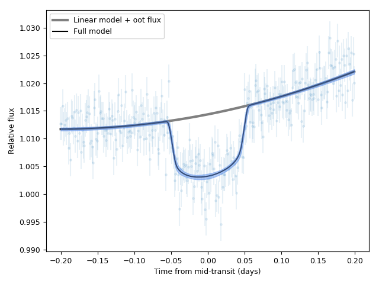

.. _linearmodels:

Incorporating linear models
===================

In previous ``juliet`` tutorials for transits (:ref:`transitfit`) and radial-velocities (:ref:`rvfits`), we have so far 
assumed that the only deterministic signals under consideration in the models :math:`\mathcal{M}_i(t)` for instrument 
:math:`i` are composed of underlying physical processes. For transits, we assume the function is a transit model 
distorted both by a normalization constant and a dilution factor, whereas for the radial-velocities we assume 
this is an addition between a Keplerian signal, a systemic radial-velocity and a long-term trend. Typically, however, 
these are not the only components that make up a model. For transits, systematics in the data (e.g., airmass trends, 
meridian flips, etc.) can distort the signals further --- for radial-velocities some linear models might help out 
constrain activity signals.

Within ``juliet`` one can model, in addition to the deterministic signal for transits and radial-velocities, 
:math:`\mathcal{M}_i(t)`, a linear model such that the full data-generating process can be written as

:math:`\mathcal{M}_i(t) + \textrm{LM}_i(t) + \epsilon_i(t)`,

where the terms :math:`\mathcal{M}_i(t)` is the transit or radial-velocity model, :math:`\epsilon_i(t)` is the 
noise model (for details on those, see previous tutorials on transits and radial-velocities), and where :math:`\textrm{LM}_i(t)` is 
a linear model given by:

:math:`\textrm{LM}_i(t) = \sum_{n=0}^{p_i}x_{n,i}(t) \theta_{n,i}^{\textrm{LM}}`.

Here, the :math:`x_{n,i}(t)` are the :math:`p_i+1` linear regressors at time :math:`t` for instrument :math:`i`, 
and the :math:`\theta_{n,i}^{\textrm{LM}}` are the coefficients of those regressors (e.g., :math:`x_{n,i}(t) = t^n` 
would model a polynomial trend for instrument :math:`i`).

Linear models in transit fits
----------------------

Adding linear terms to a model within ``juliet`` is very simple, and can be done in two ways. One way is to simply pack the lightcurve 
and regressors in a text file of the form:

.. code-block:: bash 

    2458459.7999999998 1.0126748331 0.0030000000 CHAT 1.2107127967
    2458459.8013377925 1.0127453892 0.0030000000 CHAT 1.2107915485
    2458459.8026755853 1.0158682599 0.0030000000 CHAT 1.2108919775
    2458459.8040133780 1.0117892069 0.0030000000 CHAT 1.2110140837
    2458459.8053511707 1.0125201749 0.0030000000 CHAT 1.2111578671
    2458459.8066889634 1.0133562197 0.0030000000 CHAT 1.2113233277
    .
    .
    .

where, the first column saves the times, second the relative fluxes, third errors on these relative fluxes, 
fourth the instrument names and the :math:`p_i+1` subsequent columns store the :math:`p_i+1` linear regressors 
to be fitted to the data (in the above example, 1). Once this file is created, the filename can be simply given to the 
``juliet.load`` call with the ``lcfilename`` parameter --- this will store the times, lightcurves and linear regressors 
in a given dataset. The second way is to simply pass all the linear regressors using the ``linear_regressors_lc`` variable 
of the ``juliet.load`` call --- the input should be a dictionary, where each key is a different instrument and contains 
an array of dimensions :math:`(N_i, p_i+1)`, where :math:`N_i` is the number of datapoints for instrument :math:`i`. In this 
tutorial, we will use the former way of fitting linear models.

In this tutorial we will use the dataset uploaded [`here <https://github.com/nespinoza/juliet/blob/master/docs/tutorials/lc_lm.dat>`_] --- 
this dataset has one linear regressor. For each linear regressor, we must define the prior for the coefficient :math:`\theta_{n,i}`; 
these are expected to be of the form ``thetaN_i``, where ``N`` is the numbering of the linear regressor (as given in the 
file or dictionary) and ``i`` is the instrument name. In our case, we have data from the *CHAT* telescope --- let's fit it assuming a 
linear model:

.. code-block:: python

    import juliet
    import numpy as np

    priors = {}

    # Name of the parameters to be fit:
    params = ['P_p1','t0_p1','r1_p1','r2_p1','q1_CHAT','q2_CHAT','ecc_p1','omega_p1',\
                  'rho', 'mdilution_CHAT', 'mflux_CHAT', 'sigma_w_CHAT', 'theta0_CHAT']

    # Distributions:
    dists = ['fixed','normal','uniform','uniform','uniform','uniform','fixed','fixed',\
                     'loguniform', 'fixed', 'normal', 'loguniform', 'uniform']

    # Hyperparameters
    hyperps = [3.1, [2458460,0.1], [0.,1], [0.,1.], [0., 1.], [0., 1.], 0.0, 90.,\
                       [100., 10000.], 1.0, [0.,0.1], [0.1, 1000.],[-100,100]]

    # Populate the priors dictionary:
    for param, dist, hyperp in zip(params, dists, hyperps):
        priors[param] = {}
        priors[param]['distribution'], priors[param]['hyperparameters'] = dist, hyperp

    # Load dataset:
    dataset = juliet.load(priors=priors, lcfilename = 'lc_lm.dat', out_folder = 'lm_transit_fit')
    results = dataset.fit(n_live_points = 300)

Now let's plot it:

.. code-block:: python

    t0 = np.median(results.posteriors['posterior_samples']['t0_p1'])   
 
    # Plot. First extract model:
    transit_model, transit_up68, transit_low68, components  = results.lc.evaluate('CHAT', return_err=True, \
                                                                                  return_components = True, \
                                                                                  all_samples = True)

    import matplotlib.pyplot as plt 
    plt.errorbar(dataset.times_lc['CHAT']-t0, dataset.data_lc['CHAT'], \
                 yerr = dataset.errors_lc['CHAT'], fmt = '.' , alpha = 0.1)

    # Out-of-transit flux:
    oot_flux = np.median(1./(1. + results.posteriors['posterior_samples']['mflux_CHAT']))

    # Plot non-transit model::
    plt.plot(dataset.times_lc['CHAT']-t0, oot_flux + components['lm'], color='grey', lw = 3, label = 'Linear model + oot flux')
    plt.plot(dataset.times_lc['CHAT']-t0, transit_model, color='black', label = 'Full model')
    plt.fill_between(dataset.times_lc['CHAT']-t0,transit_up68,transit_low68,\
                     color='cornflowerblue',alpha=0.5,zorder=5)

    plt.xlabel('Time from mid-transit (days)')
    plt.ylabel('Relative flux')
    plt.legend()

