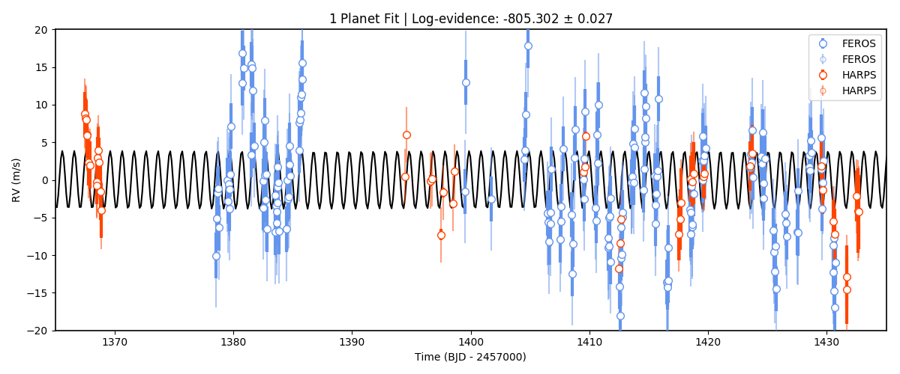
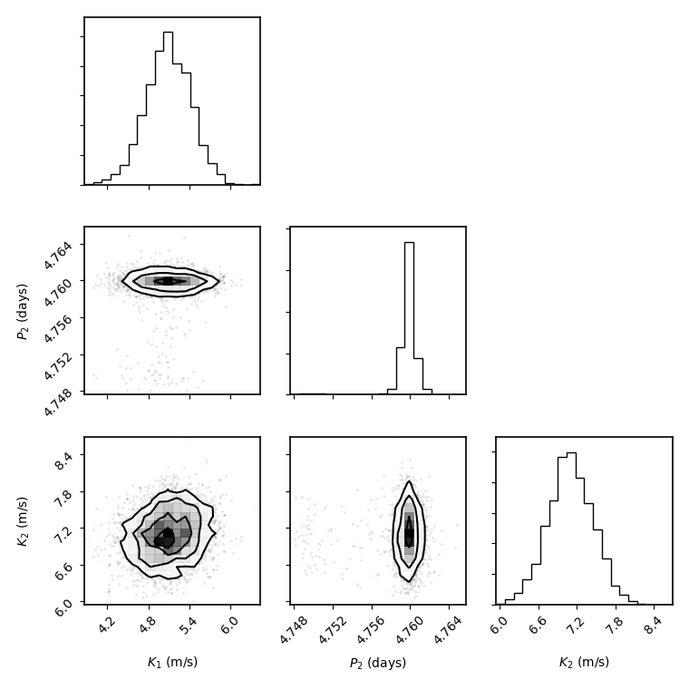
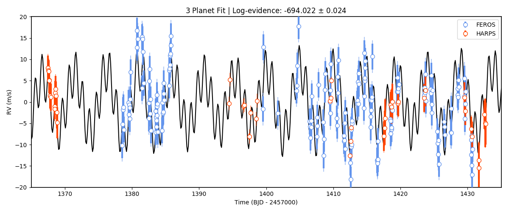
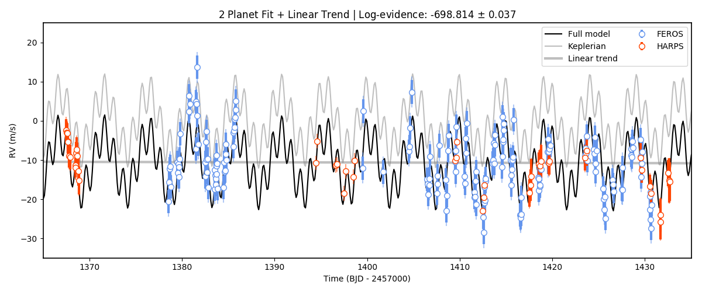

.. _rvfits:

Fitting radial-velocities
===================

In ``juliet``, the radial-velocity model is essentially the same as the one already introduced for the lightcurve in 
the :ref:`transitfit` tutorial, i.e., in the absence of extra linear terms (see :ref:`linearmodels`), is of the form 
(see Section 2 of the `juliet paper <https://arxiv.org/abs/1812.08549>`_)

:math:`\mathcal{M}_{i}(t) + \epsilon_i(t)`,

where :math:`\epsilon_i(t)` is a noise model for instrument :math:`i` (which as for the :ref:`transitfit` tutorial, 
here we assume is white-gaussian noise --- i.e., we assume :math:`\epsilon_i(t)\sim \mathcal{N}(0,\sqrt{\sigma(t)^2 + \sigma_{w,i}})`, 
where :math:`\sigma^2_{w,i}` is a jitter term added to each instrument --- we extend this to gaussian processes in the 
:ref:`gps` tutorial), and :math:`\mathcal{M}_{i}(t)` is the deterministic part of the radial-velocity model for the instrument. 
The form of this deterministic part of the model is given by

:math:`\mathcal{M}_{i}(t) = \mathcal{K}(t) + \mu_i + Q(t-t_a)^2 + A(t-t_a) + B`.

Here, :math:`\mathcal{K}(t)` is a Keplerian model which models the RV perturbations on the star due to the planets orbiting 
around it, :math:`\mu_i` is the RV of the star as measured by instrument :math:`i` and the coefficients :math:`Q, A` and 
:math:`B` define an additional long-term trend useful for modelling long-period signals in the RVs that might not be well 
modelled by an additional Keplerian signal --- :math:`t_a` is just an arbitrary value substracted to the input times for 
numerical stability of the coefficients (by default :math:`t_a = 2458460` --- but this can be defined by the user). By default, 
no long-term trend is incorporated in the models (i.e., :math:`Q = A = B = 0`).

RV fits
-------

To showcase the capabilities ``juliet`` has for radial-velocity fitting, here we will analyze the radial-velocities of the 
TOI-141 system (`Espinoza et al. (2019) <https://arxiv.org/abs/1903.07694>`_). We already analyzed the transits of this 
object in the :ref:`quicktest` tutorial; here we use the radial-velocities (RVs) of this system as it was shown that not 
only the signal of the transiting planet was present in the RVs, but there is also evidence for _another_ planet in the system. 
We have uploaded the dataset in a ``juliet``-friendly format [`here <https://github.com/nespinoza/juliet/blob/master/docs/tutorials/rvs_toi141.dat>`_].

Let us first try to find the RV signature of the transiting planet analyzed in the :ref:`quicktest` tutorial in this dataset. 
From that analysis, the period is :math:`P = 1.007917 \pm 0.000073` days and the time-of-transit center is 
:math:`t0 = 2458325.5386 \pm 0.0011`. Let us use these as priors for a first fit to the data --- let us in turn assume uniform wide 
priors for the systemic velocities for each instrument :math:`\mu_i`, jitter terms and RV semi-amplitude; let us also fix the eccentricity 
to zero for now:

.. code-block:: python
 
    import juliet
    priors = {}

    # Name of the parameters to be fit:
    params = ['P_p1','t0_p1','mu_CORALIE14', \
              'mu_CORALIE07','mu_HARPS','mu_FEROS',\
              'K_p1', 'ecc_p1', 'omega_p1', 'sigma_w_CORALIE14','sigma_w_CORALIE07',\
               'sigma_w_HARPS','sigma_w_FEROS']

    # Distributions:
    dists = ['normal','normal','uniform', \
             'uniform','uniform','uniform',\
             'uniform','fixed', 'fixed', 'loguniform', 'loguniform',\
             'loguniform', 'loguniform']

    # Hyperparameters
    hyperps = [[1.007917,0.000073], [2458325.5386,0.0011], [-100,100], \
               [-100,100], [-100,100], [-100,100], \
               [0.,100.], 0., 90., [1e-3, 100.], [1e-3, 100.], \
               [1e-3, 100.], [1e-3, 100.]]

    # Populate the priors dictionary:
    for param, dist, hyperp in zip(params, dists, hyperps):
        priors[param] = {}
        priors[param]['distribution'], priors[param]['hyperparameters'] = dist, hyperp

    dataset = juliet.load(priors = priors, rvfilename='rvs_toi141.dat', out_folder = 'toi141_rvs')
    results = dataset.fit(n_live_points = 300)   

To plot the data, one can extract the models in an analogous fashion as we did for the :ref:`transitfit` tutorial: we 
use the ``results.rv.evaluate()`` function. As with the ``results.lc.evaluate()`` function presented in the 
:ref:`transitfit` tutorial, the function receives an instrument name and optionally times in which one wants to evaluate the 
model. Because each of the RV model parts are additive, it is easy to extract, e.g., the systemic-velocity corrected keplerian 
signal by simply evaluating the model in an arbitrary instrument and substracting the median of the systemic-velocity for 
that instrument. Let us do this to plot the above defined fit to see how we did --- we'll only plot the HARPS and FEROS 
data, as the CORALIE data is not very constraining:

.. code-block:: python

    import numpy as np
    import matplotlib.pyplot as plt 
    
    # Plot HARPS and FEROS datasets in the same panel. For this, first select any 
    # of the two and substract the systematic velocity to get the Keplerian signal. 
    # Let's do it with FEROS. First generate times on which to evaluate the model:
    min_time, max_time = np.min(dataset.times_rv['FEROS'])-30,\
                         np.max(dataset.times_rv['FEROS'])+30

    model_times = np.linspace(min_time,max_time,1000)

    # Now evaluate the model in those times, and substract the systemic-velocity to 
    # get the Keplerian signal:
    keplerian = results.rv.evaluate('FEROS', t = model_times) - \
                np.median(results.posteriors['posterior_samples']['mu_FEROS'])

    # Now plot the (systematic-velocity corrected) RVs:
    fig = plt.figure(figsize=(12,5))
    instruments = ['FEROS','HARPS']
    colors = ['cornflowerblue','orangered']
    for i in range(len(instruments)):
        instrument = instruments[i]
        # Evaluate the median jitter for the instrument:
        jitter = np.median(results.posteriors['posterior_samples']['sigma_w_'+instrument])
        # Evaluate the median systemic-velocity:
        mu = np.median(results.posteriors['posterior_samples']['mu_'+instrument])
        # Plot original data with original errorbars:
        plt.errorbar(dataset.times_rv[instrument]-2457000,dataset.data_rv[instrument]-mu,\
                     yerr = dataset.errors_rv[instrument],fmt='o',\
                     mec=colors[i], ecolor=colors[i], elinewidth=3, mfc = 'white', \
                     ms = 7, label=instrument, zorder=10)

        # Plot original errorbars + jitter (added in quadrature):
        plt.errorbar(dataset.times_rv[instrument]-2457000,dataset.data_rv[instrument]-mu,\
                     yerr = np.sqrt(dataset.errors_rv[instrument]**2+jitter**2),fmt='o',\
                     mec=colors[i], ecolor=colors[i], mfc = 'white', label=instrument,\
                     alpha = 0.5, zorder=5)

    # Plot Keplerian model:
    plt.plot(model_times-2457000, keplerian,color='black',zorder=1)
    plt.ylabel('RV (m/s)')
    plt.xlabel('Time (BJD - 2457000)')
    plt.title('1 Planet Fit | Log-evidence: {0:.3f} $\pm$ {1:.3f}'.format(results.posteriors['lnZ'],\
           results.posteriors['lnZerr']))
    plt.ylim([-20,20])
    plt.xlim([1365,1435]) 

Interesting. We have plotted both the original data with the original errorbars, and the errorbars 
enlarged by the best-fit jitter term. Note how the jitter is large (specially for HARPS)? This is to 
explain the large variations that appear in this 1-planet-fit result. Could this be due to an additional 
planet? To test this hypothesis, let's try another fit but now fitting for *two* planets: the 1-day transiting one, 
and an additional one with an unknown period from, say, 1 to 10 days. To do this, add the extra priors for this model first: 

.. code-block:: python

    # Add second planet to the prior:
    params = params + ['P_p2',   't0_p2',  'K_p2',    'ecc_p2','omega_p2']
    dists = dists +   ['uniform','uniform','uniform', 'fixed', 'fixed']
    hyperps = hyperps + [[1.,10.],[2458325.,2458330.],[0.,100.], 0., 90.]

    # Repopulate priors dictionary:
    priors = {}

    for param, dist, hyperp in zip(params, dists, hyperps):
        priors[param] = {}
        priors[param]['distribution'], priors[param]['hyperparameters'] = dist, hyperp

And let's perform the second ``juliet`` fit with this two-planet system:

.. code-block:: python

    dataset = juliet.load(priors = priors, rvfilename='rvs_toi141.dat', out_folder = 'toi141_rvs_2planets')
    results2 = dataset.fit(n_live_points = 300)

Repeating the same plot as above we find:

.. figure:: rvfit_2pl.png
   :alt: Results for the 2-planet fit.

Woah! Much better fit to the data. Note also that we have plotted the log-evidences that ``juliet`` gives for these 
models --- and the log-evidence for the 2-planet model is much larger than the one for the 1-planet model, 
:math:`\Delta \ln Z = 114.4` which is a `huge` odds ratio in favor of the two-planet model. Let's plot the posterior distributions 
for the parameters of this fit using Daniel Foreman-Mackey's `corner <https://corner.readthedocs.io>`_ package:

.. code-block:: python

    import corner

    posterior_names = [r"$K_1$ (m/s)", r"$P_2$ (days)", r"$K_2$ (m/s)"]
    first_time = True
    for i in range(len(params)):
        if dists[i] != 'fixed' and params[i] != 'P_p1' and 't0' not in params[i] and \
        params[i][0:2] != 'mu' and params[i][0:5] != 'sigma':
            if first_time:
                posterior_data = results2.posteriors['posterior_samples'][params[i]]
                first_time = False
            else:
                posterior_data  = np.vstack((posterior_data, results2.posteriors['posterior_samples'][params[i]]))
    posterior_data = posterior_data.T    
    figure = corner.corner(posterior_data, labels = posterior_names)

Best-fit period of this second planet is at 4.76 days --- this is slightly off with the value cited in the paper (which is 
:math:`4.78503 \pm 0.0005`), we will touch on this "mistery" in the :ref:`jointfits` tutorial. The semi-amplitudes mostly 
agree with the values in the paper. Judging from the errorbars, it seems there still is *some* unexplained variance in the data. 
Could it be an additional planet? Let us try fitting an extra planet --- this time we will try a larger prior for the period of 
this third signal, going all the way from 1 to 40 days, which is about half the observing window for the FEROS and HARPS observations, 
which are the most constraining ones:

.. code-block:: python

    # Add third planet to the prior:
    params3pl = params + ['P_p3',   't0_p3',  'K_p3',    'ecc_p3','omega_p3']
    dists3pl = dists +   ['uniform','uniform','uniform', 'fixed', 'fixed']
    hyperps3pl = hyperps + [[1.,40.],[2458325.,2458355.],[0.,100.], 0., 90.]

    # Repopulate priors dictionary:
    priors3pl = {}

    for param, dist, hyperp in zip(params3pl, dists3pl, hyperps3pl):
        priors3pl[param] = {}
        priors3pl[param]['distribution'], priors3pl[param]['hyperparameters'] = dist, hyperp

    # Run juliet:
    dataset = juliet.load(priors = priors3pl, rvfilename='rvs_toi141.dat', out_folder = 'toi141_rvs_3planets')
    results = dataset.fit(n_live_points = 300)

The resulting fit doesn't look too different from the 2-planet one:

.. code-block:: python

    keplerian = results.rv.evaluate('FEROS', t = model_times) - \ 
                np.median(results.posteriors['posterior_samples']['mu_FEROS'])

    # Now plot the (systematic-velocity corrected) RVs:
    instruments = ['FEROS','HARPS']
    colors = ['cornflowerblue','orangered']
    fig = plt.figure(figsize=(12,5))
    for i in range(len(instruments)):
        instrument = instruments[i]
        jitter = np.median(results.posteriors['posterior_samples']['sigma_w_'+instrument])
        mu = np.median(results.posteriors['posterior_samples']['mu_'+instrument])
        # Plot original errorbars:
        plt.errorbar(dataset.times_rv[instrument]-2457000,dataset.data_rv[instrument]-mu,\
                     yerr = dataset.errors_rv[instrument],fmt='o',\
                     mec=colors[i], ecolor=colors[i], elinewidth=3, mfc = 'white', \
                     ms = 7, label=instrument, zorder=10)
        # Plot original errorbars + jitter:
        plt.errorbar(dataset.times_rv[instrument]-2457000,dataset.data_rv[instrument]-mu,\
                     yerr = np.sqrt(dataset.errors_rv[instrument]**2+jitter**2),fmt='o',\
                     mec=colors[i], ecolor=colors[i], mfc = 'white', label=None,\
                     alpha = 0.5, zorder=5)

    plt.plot(model_times-2457000, keplerian,color='black',zorder=1)
    plt.ylabel('RV (m/s)')
    plt.xlabel('Time (BJD - 2457000)')
    plt.title('3 Planet Fit | Log-evidence: {0:.3f} $\pm$ {1:.3f}'.format(results.posteriors['lnZ'],\
               results.posteriors['lnZerr']))
    plt.ylim([-20,20])
    plt.xlim([1365,1435])
    plt.legend()

In fact, the evidence is *worse* in this 3-planet fit (:math:`\ln Z_3 = -694`) than in the 2-planet fit (:math:`\ln Z_2 = -691`). 
If both models were equiprobable a-priori, these log-evidences mean that, given the data, the 2-planet model is about 
20 times more likely than the 3-planet model. So it seems that if there is some extra variance in the dataset, given 
the data at hand, this cannot be explained by an extra, third planetary signal alone --- at least not with periods between 
1 and 40 days. But what if there is a *longer* period planet creating a trend in the data? We deal with this possibility next

Long-term trends in RV data
-------

As mentioned above, within ``juliet`` it is possible to fit for a long-term trend in the data that is common to all the 
instruments, parametrized by an intercept :math:`B` (``rv_intercept`` parameter within ``juliet``), a slope :math:`A` 
(``rv_slope`` parameter within ``juliet``) and a quadratic coefficient :math:`Q` (``rv_quad`` parameter within ``juliet``). 
This long-term trend is useful to constrain signals whose periods might be longer than the current time baseline, which might 
*locally* appear as long-term trends. To fit those to the data, we just need to define priors for these parameters --- let us 
do this with the TOI-141 dataset by first trying to fit a simple linear term (i.e., let us define only the parameters 
``rv_intercept`` and ``rv_slope``). Let us give wide uniform priors for those, join those priors to the 2-planet-fit priors 
and perform the fit:

.. code-block:: python

    # Add linear trend to the prior:
    paramsLT = params + ['rv_intercept',   'rv_slope']
    distsLT = dists +   ['uniform','uniform']
    hyperpsLT = hyperps + [[-100.,100.],[-100., 100.]]

    # Repopulate priors dictionary:
    priorsLT = {}

    for param, dist, hyperp in zip(paramsLT, distsLT, hyperpsLT):
        priorsLT[param] = {}
        priorsLT[param]['distribution'], priorsLT[param]['hyperparameters'] = dist, hyperp

    # Run juliet:
    dataset = juliet.load(priors = priorsLT, rvfilename='rvs_toi141.dat', out_folder = 'toi141_rvs_lineartrend')
    results = dataset.fit(n_live_points = 300)

Before plotting the results, note that when we evaluate the model using ``results.rv.evaluate`` we will get back the *full* model --- 
that is, a Keplerian *plus* the long-term trend model in our case (plus the systemic velocity of the instrument). However, one can pass 
an extra flag to this function, the ``return_components`` flag, which in addition to the full model returns a dictionary that will have 
all the (deterministic) components of the model. Let us plot all the components of the model on top of each other using this flag:

.. code-block:: python

    # Return full model and the components of the model:
    full_model, components = results.rv.evaluate('FEROS', t = model_times, return_components = True)
    # Substract systemic RV from full model (note this is part of the components):
    full_model -= components['mu']

    # Now plot the (systematic-velocity corrected) RVs (same code as above):
    instruments = ['FEROS','HARPS']
    colors = ['cornflowerblue','orangered']
    fig = plt.figure(figsize=(12,5))
    for i in range(len(instruments)):
        instrument = instruments[i]
        jitter = np.median(results.posteriors['posterior_samples']['sigma_w_'+instrument])
        mu = np.median(results.posteriors['posterior_samples']['mu_'+instrument])
        # Plot original errorbars:
        plt.errorbar(dataset.times_rv[instrument]-2457000,dataset.data_rv[instrument]-mu,\
                     yerr = dataset.errors_rv[instrument],fmt='o',\
                     mec=colors[i], ecolor=colors[i], elinewidth=3, mfc = 'white', \
                     ms = 7, label=instrument, zorder=10)
        # Plot original errorbars + jitter:
        plt.errorbar(dataset.times_rv[instrument]-2457000,dataset.data_rv[instrument]-mu,\
                     yerr = np.sqrt(dataset.errors_rv[instrument]**2+jitter**2),fmt='o',\
                     mec=colors[i], ecolor=colors[i], mfc = 'white', label=None,\
                     alpha = 0.5, zorder=5)

    # Plot full model:
    plt.plot(model_times-2457000, full_model,color='black',zorder=1, label = 'Full model')

    # Extract model components and plot them:
    plt.plot(model_times-2457000, components['keplerian'],color='grey',zorder=0, alpha=0.5, label = 'Keplerian')
    plt.plot(model_times-2457000, components['trend'],color='grey',zorder=0,alpha=0.5, lw = 3, label = 'Linear trend')

    # Labels:
    plt.ylabel('RV (m/s)')
    plt.xlabel('Time (BJD - 2457000)')
    plt.title('2 Planet Fit + Linear Trend | Log-evidence: {0:.3f} $\pm$ {1:.3f}'.format(results.posteriors['lnZ'],\
               results.posteriors['lnZerr']))
    plt.ylim([-35,25])
    plt.xlim([1365,1435])
    plt.legend(ncol = 2)

As can be seen, the ``components`` dictionary extracted from the ``results.rv.evaluate`` function contains the Keplerian 
signal under ``components['keplerian']``, and the trend under ``components['keplerian']``. In addition, it also stores 
the Keplerians of each of the individual planets under ``components['p1']`` and ``components['p2']`` in our case. Note however, 
that the linear trend appears to not be significant in our case. So it might be that the unexplained variance could be 
explained by something else --- in the :ref:`gps` tutorial, we explore adding a Gaussian Process to the dataset in order 
to explain this. 

.. note::

    Note how in our case the ``components`` dictionary for the FEROS instrument has its systemic RV stored under 
    ``components['mu']``, which in general is *different* than taking the median of the 
    ``results.posteriors['posterior_samples']['mu_FEROS']`` array. This is because, as was already mentioned 
    in the :ref:`transitfit` tutorial, the ``results.rv.evaluate`` function (and the ``results.lc.evaluate`` function) 
    evaluate the model by default on ``nsamples = 1000`` samples of the posterior. Thus, ``components['mu']`` is the 
    median value of the systemic RV over the same ``1000`` samples as the other components, whereas 
    ``results.posteriors['posterior_samples']['mu_FEROS']`` contains *all* the samples and thus, taking the 
    median of that array should be slightly different than ``components['mu']``. This difference, of course, is 
    typically much smaller than the errors, so it shouldn't be a problem in general. One can set the ``all_samples`` 
    flag to ``True`` in the ``results.rv.evaluate`` function to use all the samples --- in this case, both should 
    give the same results.
