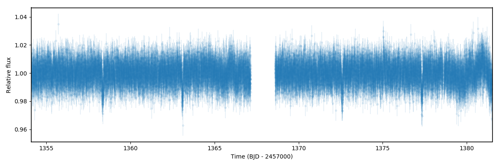
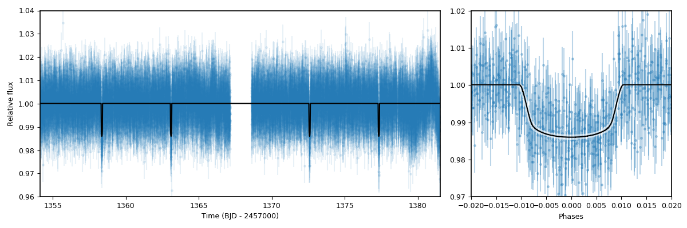

.. _transitfit:

Lightcurve fitting with juliet
==============================

We have already exemplified how to fit a basic transit lightcurve in the :ref:`quicktest` section with ``juliet``. Here, however, 
we explore some interesting extra features of the lightcurve fitting process, including limb-darkening laws, parameter transformations and 
fitting of data from multiple-instruments simultaneously, along with useful details on the model evaluations with ``juliet``.

Before going into the tutorial, it is useful to first understand the lightcurve model that ``juliet`` uses. In the absence of extra 
linear terms (which we will deal with in the :ref:`linearmodels` tutorial), a ``juliet`` lightcurve model for a given instrument 
:math:`i` is given by (see Section 2 of the `juliet paper <https://arxiv.org/abs/1812.08549>`_)

:math:`\mathcal{M}_{i}(t) + \epsilon_i(t)`,

where

:math:`\mathcal{M}_{i}(t) = [\mathcal{T}_{i}(t)D_{i} + (1-D_{i})]\left(\frac{1}{1+D_{i}M_{i}}\right)`

is the photometric model composed of the dilution factor :math:`D_{i}`, the relative out-of-transit target flux :math:`M_{i}`, 
and the transit model for the instrument :math:`\mathcal{T}_{i}(t)`
(defined by the transit parameters and by the instrument-dependant limb-darkening coefficients --- see the 
:ref:`priorsnparameters` section for details). Here, :math:`\epsilon_i(t)` is a stochastic process that defines 
a "noise model" for the dataset. In this section we will assume that :math:`\epsilon_i(t)` is white-gaussian noise, 
i.e., :math:`\epsilon_i(t)\sim \mathcal{N}(0,\sqrt{\sigma_i(t)^2 + \sigma_{w,i}^2})`, where :math:`\mathcal{N}(\mu,\sigma)` 
denotes a normal distribution with mean :math:`\mu` and standard-deviation :math:`\sigma`, and where :math:`\sigma_i(t)` are 
the errors on the datapoint at time :math:`t` and :math:`\sigma_{w,i}` is a so-called "jitter" term. We deal with 
more general noise models in the :ref:`gps` tutorial.

The ``juliet`` lightcurve model is a bit different than typical lightcurve models which typically only fit for an out-of-transit 
flux offset. The first difference is that our model includes a dilution factor :math:`D_{i}` which allows the user to account for possible contaminating 
sources in the aperture that might produce a smaller transit depth than the real one. In fact, if there are :math:`n` sources with 
fluxes :math:`F_n` in the aperture and the target has a flux :math:`F_T`, then one can show (see Section 2 of the 
`juliet paper <https://arxiv.org/abs/1812.08549>`_) that the dilution factor can be interpreted as 

:math:`D_i = \frac{1}{1 + \sum_n F_n/F_T}`.

A dilution factor of 1, thus, implies no external contaminating sources. The second difference is that the relative out-of-transit 
target flux, :math:`M_i` --- which from hereon we refer to as the "mean out-of-transit flux" --- is a multiplicative term and not an 
additive offset. This is because input lightcurves are usually normalized (typically with respect to the mean or the median), and in 
theory a simple additive offset might thus still not account for this pre-normalization of the lightcurve. :math:`M_i`, in turn, has 
a well defined interpretation: if the real out-of-transit flux was :math:`F_T + \sum_n F_n + E`, where :math:`E` is an offset flux 
given by light coming not from the sources :math:`F_n` or from the target, :math:`F_T` (e.g., background scattered light, a bias flux, 
etc.), then this term can be interpreted as :math:`E/F_T`. As can be seen, then, with :math:`D_i` and :math:`M_i`, one can uniquely 
recover the real (relative to the target) fluxes.

Transit fits
------------

To showcase the ability of ``juliet`` to fit transit lightcurves, we will play with the HATS-46b system 
(`Brahm et al., 2017 <https://arxiv.org/abs/1707.07093>`_), as  the *TESS* data for this system has interesting features that 
we will be using both in this tutorial and in the :ref:`gps` tutorial. In this tutorial in particular, we will 
play with the data obtained in Sector 2, because it seems the level of variability/systematics in this particular dataset 
is much smaller than the one for Sector 1 (which we tackle in the :ref:`gps` tutorial). First, let us download and plot the 
*TESS* data, taking the opportunity to also put the data in dictionaries so we can feed it to ``juliet``:

.. code-block:: python

   import juliet
   import matplotlib.pyplot as plt 

   # First, get arrays of times, normalized-fluxes and errors for HATS-46 
   # from Sector 1 from MAST:
   t, f, ferr  = juliet.get_TESS_data('https://archive.stsci.edu/hlsps/'+\
                                      'tess-data-alerts/hlsp_tess-data-'+\
                                      'alerts_tess_phot_00281541555-s02_'+\
                                      'tess_v1_lc.fits')

   # Put data arrays into dictionaries so we can fit it with juliet:
   times, fluxes, fluxes_error = {},{},{}
   times['TESS'], fluxes['TESS'], fluxes_error['TESS'] = t,f,ferr

   # Plot data:
   plt.errorbar(t, f, yerr=ferr, fmt='.')
   plt.xlim([np.min(t),np.max(t)])

Pretty nice dataset! The transits can be clearly seen by eye. The period seems to be about :math:`P \sim 4.7` days, in 
agreement with the `Brahm et al., 2017 <https://arxiv.org/abs/1707.07093>`_ study, and the time-of-transit center 
seems to be about :math:`t_0 \sim 1358.4` days. Let us now fit this lightcurve using these timing constraints as priors. 
We will use the same "non-informative" priors for the rest of the transit parameters as was already done for TOI-141b 
in the :ref:`quicktest` tutorial:

.. code-block:: python

    priors = {}

    # Name of the parameters to be fit:
    params = ['P_p1','t0_p1','r1_p1','r2_p1','q1_TESS','q2_TESS','ecc_p1','omega_p1',\
                  'rho', 'mdilution_TESS', 'mflux_TESS', 'sigma_w_TESS']

    dists = ['normal','normal','uniform','uniform','uniform','uniform','fixed','fixed',\
                     'loguniform', 'fixed', 'normal', 'loguniform']

    hyperps = [[4.7,0.1], [1358.4,0.1], [0.,1], [0.,1.], [0., 1.], [0., 1.], 0.0, 90.,\
                       [100., 10000.], 1.0, [0.,0.1], [0.1, 1000.]]   

Now let's fit the dataset with ``juliet``, saving the results to a folder called ``hats46``:

.. code-block:: python

   # Load and fit dataset with juliet:
   dataset = juliet.load(priors=priors, t_lc = times, y_lc = fluxes, \
                      yerr_lc = fluxes_error, out_folder = 'hats46')

   results = dataset.fit()

As was already shown in the :ref:`quicktest` tutorial, it is easy to plot the ``juliet`` fit results using the 
``results.lc.evaluate()`` function. In the background, this function extracts by default ``nsamples=1000`` random 
samples from the joint posterior distribution of the parameters and evaluates the model using them --- 
by default, a call to this function given an instrument name returns the median of all of those models. However, one can 
also retrieve the models that are about "1-sigma away" from this median model --- i.e., the 68% credibility band of these 
models --- by setting ``return_err=True``. One can actually select the percentile credibility band with the ``alpha`` parameter 
(by default, ``alpha=0.68``). Let us extract and plot the median model and the corresponding 68% credibility band around it using 
this function. We will create two plots: one of time versus flux, and another one with the phased transit lightcurve:

.. code-block:: python

    # Extract median model and the ones that cover the 68% credibility band around it:
    transit_model, transit_up68, transit_low68  = results.lc.evaluate('TESS', return_err=True)
    
    # To plot the phased lighcurve we need the median period and time-of-transit center:
    P, t0 = np.median(results.posteriors['posterior_samples']['P_p1']),\
            np.median(results.posteriors['posterior_samples']['t0_p1'])

    # Get phases:
    phases = juliet.get_phases(dataset.times_lc['TESS'], P, t0)

   
    import matplotlib.gridspec as gridspec

    # Plot the data. First, time versus flux --- plot only the median model here:
    fig = plt.figure(figsize=(12,4))
    gs = gridspec.GridSpec(1, 2, width_ratios=[2,1])
    ax1 = plt.subplot(gs[0])

    ax1.errorbar(dataset.times_lc['TESS'], dataset.data_lc['TESS'], \
                 yerr = dataset.errors_lc['TESS'], fmt = '.' , alpha = 0.1)

    # Plot the median model:
    ax1.plot(dataset.times_lc['TESS'], transit_model, color='black',zorder=10)

    # Plot portion of the lightcurve, axes, etc.:
    ax1.set_xlim([np.min(dataset.times_lc['TESS']),np.max(dataset.times_lc['TESS'])])
    ax1.set_ylim([0.96,1.04])
    ax1.set_xlabel('Time (BJD - 2457000)')
    ax1.set_ylabel('Relative flux')

    # Now plot phased model; plot the error band of the best-fit model here:
    ax2 = plt.subplot(gs[1])
    ax2.errorbar(phases, dataset.data_lc['TESS'], \
                 yerr = dataset.errors_lc['TESS'], fmt = '.', alpha = 0.3)
    idx = np.argsort(phases)
    ax2.plot(phases[idx],transit_model[idx], color='black',zorder=10)
    ax2.fill_between(phases[idx],transit_up68[idx],transit_low68[idx],color='white',alpha=0.5,zorder=5)
    ax2.set_xlabel('Phases')
    ax2.set_xlim([-0.015,0.015])
    ax2.set_ylim([0.98,1.02])

As can be seen, the lightcurve model is quite precise! In the code above we also made use of a function and a dictionary which we have not introduced in 
their entirety yet. The first is the ``juliet.get_phases(t, P, t0)`` function --- this gives you back the phases at the times ``t`` given a period ``P`` and 
a time-of-transit center ``t0``. The second is a very important dictionary: it was already briefly introduced in the :ref:`priorsnparameters` section, but 
this introduction did not pay justice to its importance. This is the ``results.posteriors`` dictionary. The ``posterior_samples`` key of this dictionary 
stores the posterior distribution of the fitted parameters --- we make use of this dictionary in detail in the next part of the tutorial.

Transit parameter transformations
---------------------------------

In the fit done in the previous section we fitted the Sector 2 *TESS* lightcurve of HATS-46b. There, however, we fitted for the transformed parameters 
``r1_p1`` and ``r2_p1`` which parametrize the planet-to-star radius ratio, :math:`p = R_p/R_*`, and the impact parameter, in our case given by 
`b = (a/R_*)\cos i`, and the limb-darkening parametrization ``q1_TESS`` and ``q2_TESS``, which in our case parametrize the coefficients :math:`u_1` and 
:math:`u_2` of the quadratic limb-darkening law. How do we transform the posterior distributions of those parametrizations, stored in the 
``results.posteriors['posterior_samples']`` dictionary back to their physical parameters? ``juliet`` has built-in functions to do just this. 

To transform from the :math:`(r_1,r_2)` plane to the :math:`(b,p)` plane, we have implemented the transformations described in 
`Espinoza (2018) <https://ui.adsabs.harvard.edu/abs/2018RNAAS...2d.209E/abstract>`_. These require one defines the minimum and maximum allowed 
planet-to-star radius ratio --- by default, within ``juliet`` the parametrization allows to 
search for all planet-to-star radius ratios from :math:`p_l = 0` to :math:`p_u = 1` (and these can be modified in the ``fit`` object --- e.g., 
``dataset.fit(...,pl= 0.0, pu = 0.2)``). The values used for each fit are always stored in ``results.posteriors['pl']`` and ``results.posteriors['pl']``. 
In our case, then, to obtain the posterior distribution of :math:`b` and :math:`p`, we can use the ``juliet.utils.reverse_bp(r1,r2,pl,pu)`` function which 
takes samples from the :math:`(r_1,r_2)` plane and converts them back to the :math:`(b,p)` plane. Let us do this transformation for the HATS-46b fit done above 
and compare with the results obtained in `Brahm et al., 2017 <https://arxiv.org/abs/1707.07093>`_:

 .. code-block:: python

    # Store posterior samples for r1 and r2:
    r1, r2 = results.posteriors['posterior_samples']['r1_p1'],\
             results.posteriors['posterior_samples']['r2_p1'] 

    # Transform back to (b,p):
    b,p = juliet.utils.reverse_bp(r1, r2, 0., 1.)

    # Plot posterior distribution:
    plt.plot(b,p,'.',alpha=0.5)

    # Extract median and 1-sigma errors for b and p from 
    # the posterior distribution:
    bm,bu,bl = juliet.utils.get_quantiles(b)
    pm,pu,pl = juliet.utils.get_quantiles(p)

    # Plot them:
    plt.errorbar(np.array([bm]),np.array([pm]),\
                 xerr = np.array([[bu-bm,bm-bl]]),\
                 yerr = np.array([[pu-pm,pm-pl]]),\
                 fmt = 'o', mfc = 'white', mec = 'black',\
                 ecolor='black', ms = 15, elinewidth = 3, \
                 zorder = 5, label = 'This work')

    # Plot values in Brahm et al. (2017):
    plt.errorbar(np.array([0.634]),np.array([0.1088]),\
                 xerr = np.array([[0.042,0.034]]), \
                 yerr = np.array([0.0027]),zorder = 5,\ 
                 label = 'Brahm et al. (2017)', fmt='o', \
                 mfc = 'white', elinewidth = 3, ms = 15) 

    plt.legend()
    plt.xlim([0.,0.8])
    plt.ylim([0.1,0.125])
    plt.xlabel('$b$')
    plt.ylabel('$p = R_p/R_*$')

.. figure:: posterior_bp.png
   :alt: Posterior distribution of the impact parameter and planet-to-star radius ratio.

The agreement with `Brahm et al., 2017 <https://arxiv.org/abs/1707.07093>`_ is pretty good! The planet-to-star 
radius ratios are consistent within one-sigma, and the (uncertain for *TESS*) impact parameter is consistent at 
less thant 2-sigma with the one published in that work. 
