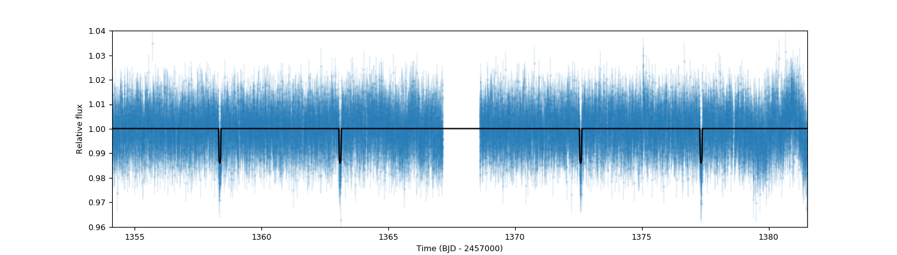
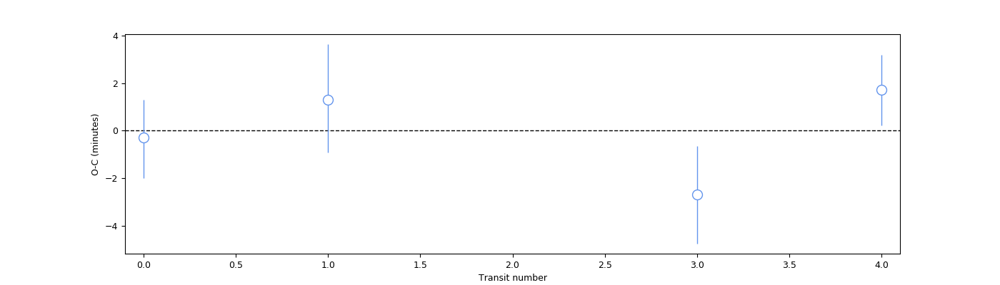
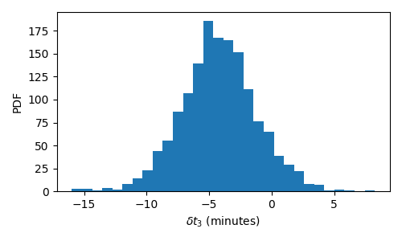

.. _ttvs:

Incorporating transit-timing variations
=======================================

The transit fits that have been presented so far in the tutorials assume that the transit times, :math:`T` are exactly periodic, i.e., 
they can be predicted by the simple relationship

:math:`T(n) = t_0 + n P`,

where :math:`t_0` is the time-of-transit center at epoch zero (:math:`n=0`), :math:`P` is the period of the orbit and :math:`n` is the transit epoch. In some particular cases, however, this simple relationship might not be satisfied. 
Because of gravitational/dynamical interactions with additional bodies in the system, the exoplanet under study might undergo what we usually refer to 
as *transit timing variations* (TTVs), where the transit times are not exactly periodic and vary due to these (in principle unknown) interactions. If we define 
those variations as extra perturbations :math:`\delta t_n` to the above defined timing equation, we can write the time-of-transit centers as:

:math:`T(n) = t_0 + n P + \delta t_n`.

Within ``juliet``, there are two ways to fit for these perturbations. One way is to fit for each of the :math:`T(n)` directly, while there is also an option 
to fit for *some* perturbations :math:`\delta t_n`. In this tutorial, we explore why those two possible parametrizations are allowed, and what they imply 
for the fits we perform. We will use the HATS-46 b TESS dataset, which we already analyzed in the :ref:`transitfit` section, as a case-study in this tutorial.

Fitting for the transit times directly
--------------------------------------

If we choose to fit for the transit times :math:`T(n)` directly, ``juliet`` will expect priors for these but it is expected that you will *not* supply priors for 
:math:`t_0` and :math:`P` (e.g., ``t0_p1`` and ``P_p1``). The reason for this is that these latter parameters will be computed directly from each sample of the 
:math:`T(n)` as the intercept (:math:`t_0`) and slope (:math:`P`) that best-fits (in a least-squares sense) the sampled :math:`T(n)`. This is, of course, a 
matter of definition --- we are assuming that what we refer to when we speak of :math:`P` and :math:`t_0` in a TTV fit are the slope and intercept, respectively, 
of a last-squares fit to the transit times.

Within `juliet`, the transit times are defined through the parameter ``T_p1_instrument_n`` --- here, ``instrument`` defines the instrument where that transit occurs (e.g., 
``TESS``), ``n`` the transit epoch and, in this case, we are fitting the transit-times to planet ``p1``; ``juliet`` is able to handle different perturbations for different planets 
in the system. 

Let's try finding how big the perturbations are on the HATS-46 b TESS dataset. For this, we use the same priors used in section :ref:`transitfit`, but we remove the priors 
on :math:`t_0` and :math:`P` (i.e., ``t0_p1`` and ``P_p1``), and add the priors for each time of transit. We will assume normal, zero-mean gaussian priors with a standard deviation 
of 0.1 days (i.e., about 2.4 hours) for the planet. We define these along the other priors previously defined for HATS-46 b as follows:

.. code-block:: python

    import juliet

    # First, load original dataset we used in the previous tutorial:
    t, f, ferr  = juliet.get_TESS_data('https://archive.stsci.edu/hlsps/'+\
                                   'tess-data-alerts/hlsp_tess-data-'+\
                                   'alerts_tess_phot_00281541555-s02_'+\
                                   'tess_v1_lc.fits')

    times, fluxes, fluxes_error = {},{},{}
    times['TESS'], fluxes['TESS'], fluxes_error['TESS'] = t,f,ferr

    # Define same parameters, distributions and hyperparameters defined in 
    # that same tutorial:
    params = ['r1_p1','r2_p1','q1_TESS','q2_TESS','ecc_p1','omega_p1',\
              'rho', 'mdilution_TESS', 'mflux_TESS', 'sigma_w_TESS']

    dists = ['uniform','uniform','uniform','uniform','fixed','fixed',\
                     'loguniform', 'fixed', 'normal', 'loguniform']

    hyperps = [[0.,1], [0.,1.], [0., 1.], [0., 1.], 0.0, 90.,\
                       [100., 10000.], 1.0, [0.,0.1], [0.1, 1000.]]

    # Add to these the transit times:
    params = params + ['T_p1_TESS_0','T_p1_TESS_1', 'T_p1_TESS_3', 'T_p1_TESS_4']
    dists = dists + ['normal','normal','normal','normal']
    hyperps = hyperps + [[1358.4,0.1],[1363.1,0.1], [1372.5,0.1], [1377.2,0.1]]

Note how we have defined transit-times only for :math:`n=0,1,3,4`. We skipped the transit with :math:`n=2` as this one falls just where there is a gap in the data (which 
happens on every TESS sector to download the data back at Earth). We now put everything together into the ``priors`` dictionary, and re-fit the data:

.. code-block:: python

    # Build the prior dictionary with the above information:
    priors = juliet.utils.generate_priors(params,dists,hyperps)

    # Load and fit dataset with juliet:
    dataset = juliet.load(priors=priors, t_lc = times, y_lc = fluxes, \
                       yerr_lc = fluxes_error, out_folder = 'hats46-ttvs')

    results = dataset.fit()

The resulting fit looks as good as the original one shown in the :ref:`transitfit` section:

.. code-block:: python

   import matplotlib.pyplot as plt

   # Extract median model and the ones that cover the 68% credibility band around it:
   transit_model = results.lc.evaluate('TESS')

   # Plot data and best-fit model:
   fig = plt.figure(figsize=(12,4))
   plt.errorbar(dataset.times_lc['TESS'], dataset.data_lc['TESS'], \
             yerr = dataset.errors_lc['TESS'], fmt = '.' , alpha = 0.1)
   plt.plot(dataset.times_lc['TESS'], transit_model, color='black',zorder=10)

   # Define labels, limits, etc. of the plot:
   plt.xlim([np.min(dataset.times_lc['TESS']),np.max(dataset.times_lc['TESS'])])
   plt.ylim([0.96,1.04])
   plt.xlabel('Time (BJD - 2457000)')
   plt.ylabel('Relative flux')

Let us, however, explore the posterior distribution of the parameters, which will enlighten us in understanding the constraints this puts on the HATS-46 b system. 
First of all, the ``posteriors.dat`` file for this fit shows the following summary statistics of the posterior distributions of the parameters:

.. code-block:: bash 

    # Parameter Name                 Median                  Upper 68 CI             Lower 68 CI 
    r1_p1                            0.5416863162            0.1568514219            0.1434447471
    r2_p1                            0.1111807484            0.0034296154            0.0035118401
    p_p1                             0.1111807484            0.0034296154            0.0035118401
    b_p1                             0.3125294743            0.2352771328            0.2151671206
    inc_p1                           88.9071308890           0.7710955693            1.0698162411
    q1_TESS                          0.2692194780            0.3474123320            0.1815095451
    q2_TESS                          0.3763637953            0.3601869056            0.2406970909
    rho                              3681.1771806645         728.0596617015          1160.9706095575
    mflux_TESS                       -0.0000894483           0.0000568777            0.0000560349
    sigma_w_TESS                     4.4343278327            57.2232056206           4.1133207064
    T_p1_TESS_0                      1358.3561072664         0.0018110928            0.0021025622
    T_p1_TESS_1                      1363.1001349693         0.0020743972            0.0019741023
    T_p1_TESS_3                      1372.5833491831         0.0017507552            0.0019396261
    T_p1_TESS_4                      1377.3292128814         0.0016890000            0.0014434932
    P_p1                             4.7429737505            0.0005494323            0.0005702781
    a_p1                             16.3556306970           1.0182669217            1.9356637282
    t0_p1                            1358.3562648736         0.0016147678            0.0016588470

First of all, note how ``juliet`` spits out not only the posterior distributions for the ``T`` parameters (i.e., the :math:`T(n)` in our notation above), but also for the 
corresponding slope (``P_p1``) and intercept (``t0_p1``) that best fits the transit times. These are actually pretty useful to plot the observed (i.e., the :math:`T(n)`) 
minus the predicted (assuming the transits were exactly periodic, i.e., :math:`t0 + nP`) variations from our data, which is actually what allows us to see what level 
(amplitude) of TTVs our data constrain. We can plot this so-called "O-C" plot as follows:

.. code-block:: python

    # To extract O-C data from the posterior distributions, first define some variables:
    transit_numbers = np.array([0,1,3,4])
    OC = np.zeros(len(transit_numbers))
    OC_up_err = np.zeros(len(transit_numbers))
    OC_down_err = np.zeros(len(transit_numbers))
    instrument = 'TESS'
    # Now go through known transit-numberings, and generate the O-C distributions. From there, 
    # compute the medians and 68% credibility bands:
    for i in range(len(transit_numbers)):
        transit_number = transit_numbers[i]
        # Compute distribution of predicted times:
        computed_time = results.posteriors['posterior_samples']['t0_p1'] + transit_number*results.posteriors['posterior_samples']['P_p1']
        # Extract observed times:
        observed_time = results.posteriors['posterior_samples']['T_p1_'+instrument+'_'+str(transit_number)]
        # Generate O-C (multiply by 24*60 to get it in minutes) posterior distribution, 
        # and get quantiles from it:
        val,vup,vdown = juliet.utils.get_quantiles((observed_time - computed_time)*24*60.)
        # Save value and "1-sigma" errors:
        OC[i], OC_up_err[i], OC_down_err[i] = val, vup-val,val-vdown

    # Finally, generate plot with the O-C:
    fig = plt.figure(figsize=(14,4))
    plt.errorbar(transit_numbers,OC,yerr=[OC_down_err,OC_up_err],fmt='o',mfc='white',mec='cornflowerblue',ecolor='cornflowerblue',ms=10,elinewidth=1,zorder=3)
    plt.plot([-0.1,4.1],[0.,0],'--',linewidth=1,color='black',zorder=2)
    plt.xlim([-0.1,4.1])
    plt.xlabel('Transit number')
    plt.ylabel('O-C (minutes)')
    plt.savefig('oc.png',transparent=True)

Beautiful! From this plot we can see that any possible TTV amplitudes are constrained to be below ~a couple of minutes if they exist within the observed time-frame of the 
HATS-46 b observations in this sector.

Fitting for transit timing perturbations
----------------------------------------

Suppose a colleague of yours (or a referee) finds that transit number 3 above is "interesting", as it is more than one sigma away from the dashed line (i.e., 1-sigma away from 
showing "no deviation from a perfectly periodic transit"). You answer back that, assuming the errors are more or less gaussian, having 1 out of 4 datapoints not matching at 1-sigma 
is expected. However, they are still intrigued: is there evidence in the data for that transit being special in terms of its transit timing? Could it be that a hint from TTVs 
showed up on that particular transit? Answering questions like this one is when fitting for the TTV perturbations defined above, the :math:`\delta t_n`, becomes handy. 

Let's assume that all the other transits are periodic except for transit number 3. To fit for an extra perturbation in that transit, within ``juliet`` we use the ``dt_p1_instrument_n`` 
parameters --- here, ``instrument`` defines the instrument where that transit occurs (e.g., ``TESS``), ``n`` the transit epoch and, in this case, we are fitting the transit-time perturbation 
to planet ``p1``. Again, ``juliet`` is able to handle different perturbations for different planets. In our case, then, we will be adding a parameter ``dt_p1_TESS_3``, and will in addition 
be providing priors for the time-of-transit center (``t0_p1``) and period (``P_p1``) in the system, which will be in turn constrained by the other transits. To do this with ``juliet`` we 
would do the following. First, we set the usual priors (the same as the original fit done in the :ref:`transitfit` section):

.. code-block:: python

    # Name of the parameters to be fit:
    params = ['P_p1','t0_p1','r1_p1','r2_p1','q1_TESS','q2_TESS','ecc_p1','omega_p1',\
                  'rho', 'mdilution_TESS', 'mflux_TESS', 'sigma_w_TESS']

    # Distributions:
    dists = ['normal','normal','uniform','uniform','uniform','uniform','fixed','fixed',\
                     'loguniform', 'fixed', 'normal', 'loguniform']

    # Hyperparameters
    hyperps = [[4.7,0.1], [1358.4,0.1], [0.,1], [0.,1.], [0., 1.], [0., 1.], 0.0, 90.,\
                       [100., 10000.], 1.0, [0.,0.1], [0.1, 1000.]]

    # Populate the priors dictionary:
    for param, dist, hyperp in zip(params, dists, hyperps):
        priors[param] = {}
        priors[param]['distribution'], priors[param]['hyperparameters'] = dist, hyperp

However, we now add the perturbation to the third transit. We wrap up the ``priors`` dictionary and perform the fit:

.. code-block:: python

    params = params + ['dt_p1_TESS_3']
    dists = dists + ['normal']
    hyperps = hyperps + [[0.0,0.1]]

    # Populate the priors dictionary:
    priors = juliet.utils.generate_priors(params,dists,hyperps)

    # Load and fit dataset with juliet:
    dataset = juliet.load(priors=priors, t_lc = times, y_lc = fluxes, \
                       yerr_lc = fluxes_error, out_folder = 'hats46-ttvs-perturbations', verbose = True)

    results = dataset.fit(n_live_points)

The resulting posterior on the timing perturbation looks as follows:

Is this convincing evidence for something special happening in transit 3? Luckily, ``juliet`` reports the bayesian evidence of this fit, which is :math:`\ln Z_{per} = 64199`. The corresponding 
evidence for the fit done in the :ref:`transitfit` section (with no perturbation) is :math:`\ln Z_{no-per} = 64202.1` --- so a :math:`\Delta \ln Z = 3` in favour of **no** perturbation. The model 
without this timing perturbation is *about 20 times more likely given the data at hand* than the one with the perturbation. A pretty good bet against something special happening on transit 
number 3 for me (and probably you, your colleague and the referee!).

.. note::

        The implementation discussed here was enormously beneffited by the discussions presented in the literature, both on the `EXOFASTv2 paper <https://arxiv.org/abs/1907.09480>`_ (Section 18)
        and the discussion on the ``exoplanet`` package `about their TTV implementation <https://exoplanet-docs.readthedocs.io/en/stable/tutorials/ttv/>`_. We refer the users to these sources to 
        learn more about this particular implementation of TTVs, and note that this is an approximation to the real dynamical problem that TTVs impose on 
        transiting exoplanetary systems, as we are not considering changes to the other transit parameters. Photodynamical models are not yet supported within ``juliet``.
