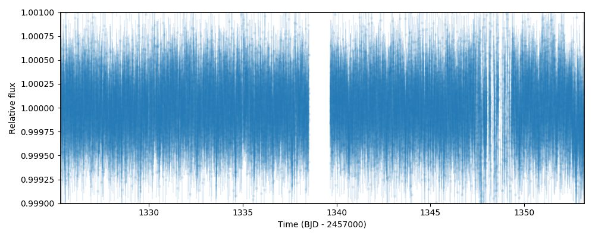
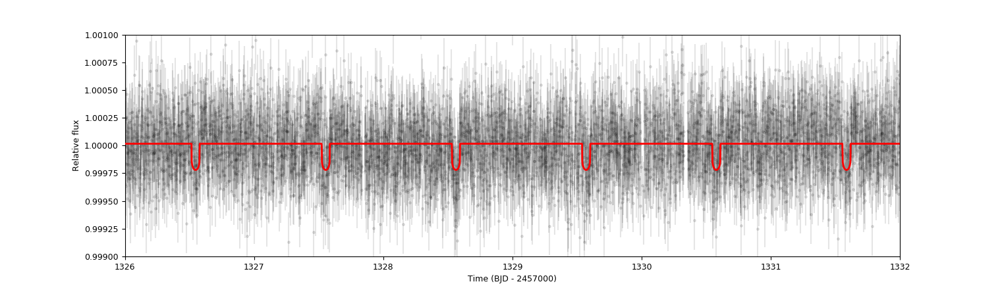

.. _quicktest:

Getting started
===================

Two ways of using juliet
-------------------------

In the spirit of accomodating the code for everyone to use, ``juliet`` can be used in two different ways: as 
an **imported library** and also in **command line mode**. Both give rise to the same results because the command 
line mode simply calls the ``juliet`` libraries in a python script.

To use ``juliet`` as an **imported library**, inside any python script you can simply do:

.. code-block:: python

    import juliet
    dataset = juliet.load(priors = priors, t_lc=times, y_lc=flux, yerr_lc=flux_error)
    results = dataset.fit()

In this example, ``juliet`` will perform a fit on a lightcurve dataset defined by a dictionary of times ``times``, 
relative fluxes ``flux`` and error on those fluxes ``flux_error`` given some prior information ``priors`` which, 
as we will see below, is also defined through a dictionary. 

In **command line mode**, ``juliet`` can be used through a simple call in any terminal. To do this, after 
installing juliet, you can from anywhere in your system simply do:

.. code-block:: bash

    juliet -flag1 -flag2 --flag3

In this example, ``juliet`` is performing a fit using different inputs defined by ``-flag1``, ``-flag2`` and ``--flag3``. 
There are several flags that can be used to accomodate your ``juliet`` runs through command-line which we'll explore 
in the tutorials. There is a third way of using ``juliet``, which is by calling the ``juliet.py`` code and applying 
these same flags (as it is currently explained in `project's wiki page <https://github.com/nespinoza/juliet/wiki>`_). 
However, no further updates will be done for that method, and the ones defined above should be the preferred ones to 
use.

A first fit to data with juliet
-----------------------------------------------

To showcase how ``juliet`` works, let us first perform an extremely simple fit to data using ``juliet`` as an *imported library*. 
We will fit the TESS data of TOI-141 b, which was shown to host a 1-day transiting exoplanet by 
`Espinoza et al. (2019) <https://arxiv.org/abs/1903.07694>`_. Let us first load the data corresponding to this 
object, which is hosted in MAST. For TESS data, ``juliet`` has already built-in functions to load the data arrays 
directly given a web link to the data --- let's load it and plot the data to see how it looks:

.. code-block:: python

    import juliet
    import numpy as np 
    # First, get times, normalized-fluxes and errors for TOI-141 from MAST:
    t,f,ferr  = juliet.get_TESS_data('https://archive.stsci.edu/hlsps/tess-data-alerts/'+\
                                     'hlsp_tess-data-alerts_tess_phot_00403224672-'+\
                                     's01_tess_v1_lc.fits')

    # Plot the data!
    import matplotlib.pyplot as plt
    plt.errorbar(t,f,yerr=ferr,fmt='.')

    plt.xlim([np.min(t),np.max(t)])
    plt.ylim([0.999,1.001])
    plt.xlabel('Time (BJD - 2457000)')
    plt.ylabel('Relative flux')

    
This will save arrays of times, fluxes (``PDCSAP_FLUX`` fluxes, in particular) and errors on the ``t``, ``f`` and ``ferr`` arrays. Now, 
in order to load this dataset into a format that ``juliet`` likes, we need to put these into dictionaries. This, as we will 
see, will make it extremely easy to add data from more instruments, as these will be simply stored in different 
keys of the same dictionary. For now, let us just use this TESS data; we put them in dictionaries that ``juliet`` likes as 
follows:

.. code-block:: python

    # Create dictionaries:
    times, fluxes, fluxes_error = {},{},{}
    # Save data into those dictionaries:
    times['TESS'], fluxes['TESS'], fluxes_error['TESS'] = t,f,ferr
    # If you had data from other instruments you would simply do, e.g.,
    # times['K2'], fluxes['K2'], fluxes_error['K2'] = t_k2,f_k2,ferr_k2

The final step to fit the data with ``juliet`` is to define the priors for the different parameters that we
are going to fit. This can be done in two ways. The longest (but more jupyter-notebook-friendly?) is to
create a dictionary that, on each key, has the names of the parameter to be fitted. Each of those elements 
will be dictionaries themselves, containing the ``distribution`` of the parameter and their corresponding 
``hyperparameters`` (for details on what distributions ``juliet`` can handle, what are the hyperparameters and 
what each parameter name mean, see the next section of this document: :ref:`priorsnparameters`). 

Let us give normal priors for the period ``P_p1``, time-of-transit center ``t0_p1``, mean out-of-transit
flux ``mflux_TESS``, uniform distributions for the parameters ``r1_p1`` and ``r2_p1`` of the 
`Espinoza (2018) <https://ui.adsabs.harvard.edu/abs/2018RNAAS...2d.209E/abstract>`_ parametrization
for the impact parameter and planet-to-star radius ratio, same for the ``q1_p1`` and ``q2_p1`` 
`Kipping (2013) <https://ui.adsabs.harvard.edu/abs/2013MNRAS.435.2152K/abstract>`_
limb-darkening parametrization (``juliet`` assumes a quadratic limb-darkening by default --- other laws can 
be easily defined, as it will be shown in the tutorials), log-uniform distributions for the stellar density 
``rho`` (in kg/m3) and jitter term ``sigma_w_TESS`` (in parts-per-million, ppm), and leave the rest of the 
parameters (eccentricity ``ecc_p1``, argument of periastron (in degrees) ``omega_p1`` and dilution factor 
``mdilution_TESS``) fixed:

.. code-block:: python

    priors = {}

    # Name of the parameters to be fit:
    params = ['P_p1','t0_p1','r1_p1','r2_p1','q1_TESS','q2_TESS','ecc_p1','omega_p1',\
                  'rho', 'mdilution_TESS', 'mflux_TESS', 'sigma_w_TESS']

    # Distribution for each of the parameters:
    dists = ['normal','normal','uniform','uniform','uniform','uniform','fixed','fixed',\
                     'loguniform', 'fixed', 'normal', 'loguniform']

    # Hyperparameters of the distributions (mean and standard-deviation for normal 
    # distributions, lower and upper limits for uniform and loguniform distributions, and 
    # fixed values for fixed "distributions", which assume the parameter is fixed)
    hyperps = [[1.,0.1], [1325.55,0.1], [0.,1], [0.,1.], [0., 1.], [0., 1.], 0.0, 90.,\
                       [100., 10000.], 1.0, [0.,0.1], [0.1, 1000.]]

    # Populate the priors dictionary:
    for param, dist, hyperp in zip(params, dists, hyperps):
        priors[param] = {}
        priors[param]['distribution'], priors[param]['hyperparameters'] = dist, hyperp

With these definitions, to fit this dataset with ``juliet`` one would simply do:

.. code-block:: python

    # Load dataset into juliet, save results to a temporary folder called toi141_fit:
    dataset = juliet.load(priors=priors, t_lc = times, y_lc = fluxes, \
                          yerr_lc = fluxes_error, out_folder = 'toi141_fit')

    # Fit and absorb results into a juliet.fit object:
    results = dataset.fit(n_live_points = 300)

This code will run ``juliet`` and save the results both to the ``results`` object and to the ``toi141_fit`` 
folder.

The second way to define the priors for ``juliet`` (and perhaps the most simple) is to create a text file where
in the first column one defines the parameter name, in the second column the name of the ``distribution`` and
in the third column the ``hyperparameters``. The priors defined above would look like this in a text file:

.. code-block:: bash

    P_p1                 normal               1.0,0.1   
    t0_p1                normal               1325.55,0.1 
    r1_p1                uniform              0.0,1.0 
    r2_p1                uniform              0.0,1.0    
    q1_TESS              uniform              0.0,1.0 
    q2_TESS              uniform              0.0,1.0 
    ecc_p1               fixed                0.0 
    omega_p1             fixed                90.0
    rho                  loguniform           100.0,10000.0
    mdilution_TESS       fixed                1.0
    mflux_TESS           normal               0.0,0.1
    sigma_w_TESS         loguniform           0.1,1000.0

To run the same fit as above, suppose this prior file is saved under ``toi141_fit/priors.dat``. Then, to load this
dataset into ``juliet`` and fit it, one would do:

.. code-block:: python

    # Load dataset into juliet, save results to a temporary folder called toi141_fit:
    dataset = juliet.load(priors='toi141_fit/priors.dat', t_lc = times, y_lc = fluxes, \
                          yerr_lc = fluxes_error, out_folder = 'toi141_fit')

    # Fit and absorb results into a juliet.fit object:
    results = dataset.fit(n_live_points = 300)

And that's it! Cool ``juliet`` fact is that, once you have defined an ``out_folder``, **all your data will be saved there --- 
not only the prior file and the results of the fit, but also the photometry or radial-velocity you fed into juliet will 
be saved**. This makes it easy to come back later to this dataset without having to download the data all over again, or 
re-run your fits. So, for example, suppose we have already ran the code above, closed our terminals, and wanted to come back 
at this dataset again with another ``python`` session and say, plot the data and best-fit model. To do this one can simply do:

.. code-block:: python

   import juliet
 
   # Load already saved dataset with juliet:
   dataset = juliet.load(input_folder = 'toi141_fit', out_folder = 'toi141_fit')

   # Load results (the data.fit call will recognize the juliet output files in 
   # the toi141_fit folder generated when we ran the code for the first time):
   results = dataset.fit()

   import matplotlib.pyplot as plt

   # Plot the data:
   plt.errorbar(dataset.times_lc['TESS'], dataset.data_lc['TESS'], \
                yerr = dataset.errors_lc['TESS'], fmt = '.', alpha = 0.1)

   # Plot the model:
   plt.plot(dataset.times_lc['TESS'], results.lc.evaluate('TESS')) 

   # Plot portion of the lightcurve, axes, etc.:
   plt.xlim([1326,1332])
   plt.ylim([0.999,1.001])
   plt.xlabel('Time (BJD - 2457000)')
   plt.ylabel('Relative flux')
   plt.show()

Which will give us a nice plot of the data and the ``juliet`` fit:

.. WARNING:: When using MultiNest, make sure that the ``out_folder`` full path is less than 69 characters long. This is because MultiNest internally has a character limit for the full output path of 100 characters (`see this fun discussion <https://github.com/JohannesBuchner/PyMultiNest/issues/107>`_). Because the largest MultiNest output ``juliet`` produces (produced by MultiNest itself) is called ``jomnest_post_equal_weights.dat``, which has 30 characters, this leaves the possible total character length of the folder to be 69 characters not counting the backlash at the end. Bottom line: when using MultiNest, stick to small ``out_folder`` lengths.
